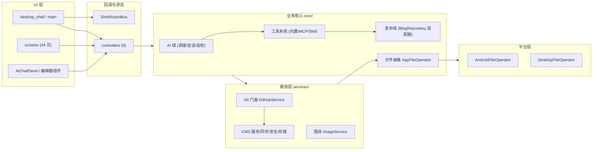
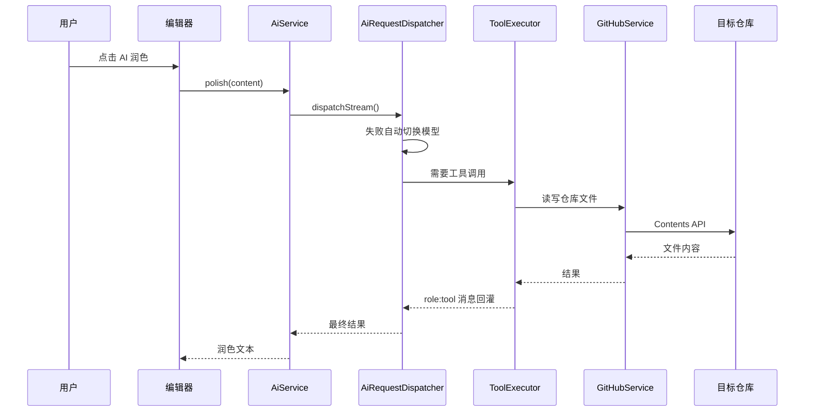
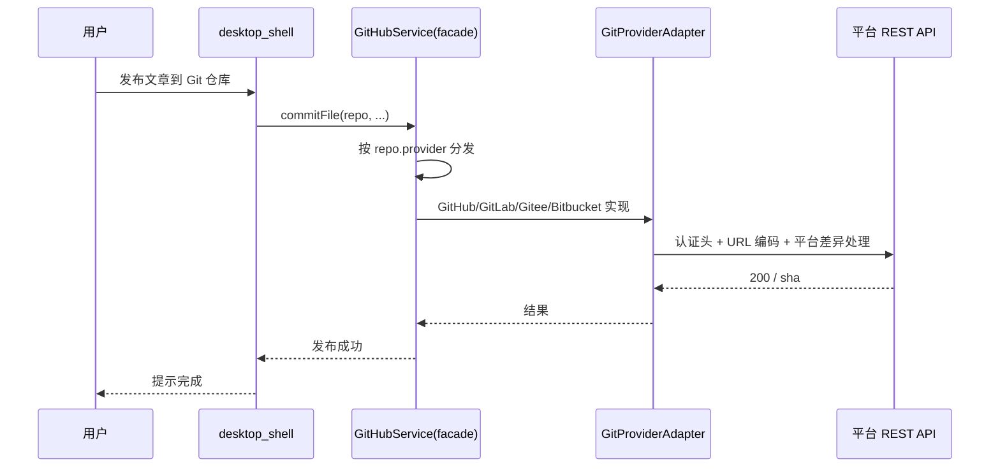

# 拓墨（Hexo）系统架构

## 概述

拓墨是一款 AI 驱动的 Markdown 写作与博客发布工具，面向博客作者与内容创作者，覆盖 Android / iOS / Web / Windows / macOS / Linux 全平台。它将「写作、AI 辅助、多平台发布、图床、站点管理、数据同步与安全」整合进一个统一工作台：用户用 Markdown 完成写作，交给 AI 润色续写，一键发布到 GitHub / GitLab / Gitee / Bitbucket 托管的 Hexo / Hugo / Jekyll 等静态博客，或通过 REST API 发布到 WordPress / Ghost / Typecho 动态 CMS。

系统由七大能力域构成：AI 写作域（多模型调度、7 类会话、工具调用闭环）、多平台发布域（Git 四平台适配 + 静态/动态博客仓库适配）、图床与资源域、数据安全域（AES-256-GCM 加密、站点隔离、版本快照、回收站、冲突解决）、同步域（GitHub 云同步 / WebDAV / 局域网 P2P）、工具系统（内置工具 / Skill / MCP 服务器）以及桌面外壳（窗口、托盘、全局快捷键、多模式布局）。

架构上采用分层 + 门面模式：业务核心（`lib/core/`）与 UI（`lib/screens/`、`lib/desktop/`）解耦，
全部 Git 操作经 `GitHubService` 门面按平台分发到 `GitProviderAdapter` 实现（UI 层禁止直连
平台 API，2026-09 复盘后已收口）。
> 2026-09 全量复盘：原声称的 `AppFileOperator` 文件抽象层（core/file_manager + platform/）
> 因全仓零调用已整体删除，平台文件操作直接走 dart:io + path_provider；
> FrontMatterController（零消费）删除后 MultiProvider 为 6 控制器。

## 技术栈

**语言与运行时**
- Dart / Flutter（SDK `>=3.10.7 <4.0.0`，环境 Flutter 3.44.9）
- 目标平台：Android、iOS、Web、Windows、macOS、Linux（桌面）

**框架与状态管理**
- Flutter（Material Design）
- `provider` 状态管理
- 编辑器自研分层：`DocumentController`（纯数据层）+ `EditorController`（视图状态层），对标 VS Code MVVM

**数据存储**
- SQLite（`sqflite` + `sqflite_common_ffi`）：CMS 草稿、会话快照
- JSON 文件（`~/.hexo_app` 全局存储目录，按分类子文件夹组织）
- `pointycastle` AES-256-GCM 站点数据加密

**Markdown 与内容处理**
- `flutter_markdown` / `markdown`（渲染）
- `flutter_highlight` / `highlight`（代码高亮）
- 自研 `MarkdownDiff` / `ConflictDiffService`（Myers LCS 行级 diff）
- `HtmlToMarkdown`（HTML → Markdown 转换）、`FrontMatterService`（YAML/TOML）
- 自研 Ripgrep + Isolate 全文搜索

**导出能力**
- `printing` + `pdf`（PDF 导出）
- `archive`（DOCX / EPUB 导出，DOCX 导入）

**网络与集成**
- `http`（Git / CMS / WebDAV REST）
- `flutter_inappwebview`（内嵌站点预览）、`webview_flutter`
- `file_picker`、`desktop_drop`（文件选择与拖拽）
- `url_launcher`、`share_plus`、`package_info_plus`

**桌面集成**
- `window_manager`（自定义标题栏 / 窗口管理）
- `system_tray` / `tray_manager`（系统托盘）
- 全局快捷键（`CallbackShortcuts` + 自定义覆盖）

**CI/CD**
- GitHub Actions（`build.yml`）：Web 构建 + Android APK 产物

**外部服务**
- Git 托管：GitHub、GitLab、Gitee、Bitbucket（Contents / Files / Repository 等 REST API）
- 动态 CMS：WordPress REST、Ghost Admin API、Typecho（SecureApi / Restful / FastApi 三插件）
- 云同步：GitHub 私有仓库、WebDAV 服务器
- AI：12 个预置 Provider（OpenAI / DeepSeek / 通义 / GLM / Kimi / 豆包 / Gemini / Claude 等），OpenAI 兼容协议

## 项目结构

```
lib/
├── main.dart                # 入口 + _RootShellState 核心状态（生命周期/会话/导航）
├── desktop/                 # 桌面外壳
│   ├── desktop_main.dart    # 桌面入口：托盘/快捷键/拖拽导入/窗口管理
│   ├── desktop_shell.dart   # 桌面主类（约2.4千行：生命周期/引导/动作分发）
│   ├── shell_parts/         # 16 个业务域 part 扩展（发布/同步/AI/弹窗/UI…约1万行）
│   ├── shell_action_bus.dart# 统一回调总线（消除 37+ 回调地狱）
│   └── widgets/             # 桌面组件（标题栏/左导航/分栏编辑器/命令面板…）
├── screens/                 # 功能页面（2026-09 清理后 38 个）
├── services/                # 服务（Git/CMS/AI/同步/安全/存储；2026-09 清理 7 个死服务）
├── models/                  # 21 个数据模型
├── controllers/             # 6 个控制器（文档/编辑/布局/同步/站点/UI 状态）
├── mixins/                  # 10 个 State 扩展 part（发布/同步/设置/AI/仓库…）
├── core/                    # 业务核心（与 UI 解耦）
│   ├── ai/                  # AI 会话/模型调度/自检/迁移/工具创建（11 文件）
│   ├── tools/               # 工具系统：内置工具/MCP/Skill/执行器/校验器
│   ├── repository/          # 博客仓库适配层（8 文件）
│   ├── task/                # Agent 任务模型
│   ├── diff/                # MarkdownDiff 行级 diff
│   ├── template_engine/     # 模板解析引擎
│   └── utils/               # 字数统计等纯工具
├── widgets/                 # 独立公开组件（平滑预览/实验性所见即所得/字数徽标/AI 面板…）
├── theme/                   # 主题控制器与配色
└── l10n/                    # 应用本地化
```
> 2026-09 全量复盘删除：core/file_manager + platform/（AppFileOperator 抽象层，全仓零调用）、
> examples/、7 个死服务、5 个死页面、editor_screen.dart(+.bak)、assets/preview/（WebView
> 预览备选方案 ~4MB 死资源）、markdown_syntax_highlighter/code_highlight 等孤儿组件。

**入口点**
- `lib/main.dart` — 全平台入口，`_RootShellState` 状态类
- `lib/desktop/desktop_main.dart` — 桌面端入口（托盘、快捷键、拖拽导入）
- CI：`.github/workflows/build.yml` — push 触发 analyze + Android/Web/Windows/Linux 四端构建；tag 触发 Release

## 子系统

### 1. AI 写作域
**目的**: 多模型 AI 写作、对话、内容审计与主题开发。
**位置**: `lib/core/ai/`、`lib/services/ai_service.dart`
**关键文件**: `ai_request_dispatcher.dart`（流式分发/故障切换/工具循环）、`ai_session_manager.dart`（7 类会话 System Prompt 工厂）、`ai_model_manager.dart`（模型 CRUD/密钥池轮转/连通性检测）、`ai_self_checker.dart`（两级自检）、`theme_migration_service.dart`（跨框架主题迁移）
**依赖**: `tools/`（工具执行）、`services/`（Git/CMS 读写）
**被依赖**: 6 个 AI 会话 Screen、`agent_workbench_screen.dart`、`ai_chat_panel.dart`

### 2. 多平台发布域
**目的**: 将文章发布到 Git 托管静态博客或动态 CMS。
**位置**: `lib/services/git_*.dart`、`lib/core/repository/`
**关键文件**: `github_service.dart`（门面）、`git_providers.dart`（GitHub/GitLab/Gitee/Bitbucket 实现）、`git_provider_adapter.dart`（抽象接口）、`static_blog_repository.dart`、`wordpress_adapter.dart`、`ghost_adapter.dart`、`typecho_adapter.dart`（及 Restful/FastApi 变体）、`site_manager.dart`（工厂中枢）、`static_blog_batch_publish_service.dart`（批量发布）
**依赖**: `models/`（RepoConfig/BlogSiteConfig/GitProviderType）
**被依赖**: 发布相关全部 Screen、AI 工具、图床

### 3. 图床与资源域
**目的**: 图片上传、图床管理、死链检测与 URL 替换。
**位置**: `lib/services/image_service.dart`、`lib/screens/image_bed_screen.dart`
**关键文件**: `image_service.dart`（压缩/上传/按图床平台路由）、`image_bed_screen.dart`（浏览/删除/CDN 链接/死链扫描/URL 替换）
**依赖**: Git 多平台层（图床跟随仓库平台）
**被依赖**: 编辑器（图片插入）

### 4. 数据安全域
**目的**: 数据加密、站点隔离、版本快照、回收站与冲突解决。
**位置**: `lib/services/`
**关键文件**: `site_encryption_service.dart`（AES-256-GCM）、`site_isolation_service.dart`、`version_snapshot_service.dart`、`recycle_bin_service.dart`、`conflict_diff_service.dart`
**依赖**: dart:io + path_provider（平台文件操作直接实现，无抽象层）
**被依赖**: 编辑器、移动端快照/回收站/冲突页

### 5. 数据同步域
**目的**: 多端数据互通（手机 ↔ 桌面）。
**位置**: `lib/services/`
**关键文件**: `cloud_sync_service.dart`（GitHub 私有仓库 + WebDAV 后端）、`webdav_service.dart`、`p2p_sync_service.dart`（局域网 P2P）、`sync_service.dart`（CMS 双向同步状态机）
**依赖**: 存储层、`models/`
**被依赖**: `sync_settings_screen.dart`、`p2p_sync_screen.dart`、`sync_screen.dart`
> SyncController 2026-09 复盘后仅保留日志职责（addLog/logs），同步状态由各界面自持。

### 6. 工具系统
**目的**: 让 AI 具备工具调用能力（内置 / Skill / MCP）。
**位置**: `lib/core/tools/`
**关键文件**: `builtin_tools.dart`（21 个内置工具：Web 搜索四引擎、文件读写、Git 快照/回滚/克隆、Skill/模板管理）、`remote_cms_tools.dart`（16 个 CMS 工具）、`tool_executor.dart`（执行器）、`tool_registry.dart`（注册表）、`mcp_runtime.dart`（AI 指令运行时）、`mcp_server.dart`（外部 MCP 服务器）、`skill_manager.dart`、`tool_schema_validator.dart`（危险操作黑名单校验）、`instruction_parser.dart`（指令解析）
**依赖**: `core/ai/`（凭据脱敏/工具创建）、`repository/`
**被依赖**: `ai_chat_panel.dart`、`ai_request_dispatcher.dart`

### 7. 桌面外壳
**目的**: 桌面端完整工作台体验。
**位置**: `lib/desktop/`
**关键文件**: `desktop_main.dart`、`desktop_shell.dart`、`shell_action_bus.dart`
**依赖**: 全部服务域
**被依赖**: 桌面平台入口

## 图表







## 代码地图与改码守则（2026-09-12 全面更新，改码前必读）

> 本节是「基础架构速查」：新会话读完本节即可动手，无需重新探索仓库。

### A. 双入口与启动流

```
桌面: desktop_main.runDesktopApp()
  sqflite FFI 初始化 → windowManager(无边框+位置记忆) → 系统托盘 → 全局快捷键
  → MultiProvider 注入 7 控制器 → MaterialApp(theme 来自 DesignConfig) → DesktopShell
  注意：桌面 DesignConfig 是会话级内存状态（desktop_main 持有，不持久化），
       改默认值 = 对全体用户生效；语言 locale 也在这一层。
移动/Web: main.dart main()
  → MultiProvider 注入同 7 控制器 → RootShell（_RootShellState + 10 个 mixin part）
  平台差异在构建目标层面（-t lib/desktop/desktop_main.dart），main.dart 无运行时平台分支。
```

### B. 桌面端结构（lib/desktop/）

**DesktopShellState 主文件**（desktop_shell.dart，约 2.4 千行）保留：
字段与 getter（20+ 服务单例：storage/github/aiService/siteManager/syncService…）、
生命周期（initState/dispose/didChangeDependencies/build）、引导（_bootstrap*）、
动作分发器 handleGlobalAction（60+ case 大 switch）、公开 API
（flushAllPendingSaves/handleGlobalAction/openExternalFile）、_applyState 包装。

**16 个业务域 part**（shell_parts/，extension on DesktopShellState，同 library 可访问私有成员）：

| part 文件 | 业务域 | 代表方法 |
|---|---|---|
| shell_publish_ext | 发布/保存/定时 | _handlePublish _publishToCms _schedulePublish _saveLocal |
| shell_sync_ext | 云同步/WebDAV/冲突 | _autoSyncToCloud _showWebDavDialog _computeDiff |
| shell_autosave_ext | 自动保存/跟踪 | _startAutoSave _onContentChanged _flushAllPendingSaves |
| shell_drafts_ext | 文章/标签页/会话 | _newArticle _openExistingArticle _restoreSession |
| shell_remote_ext | 远程内容 | _openRemote _rollbackRemoteFile |
| shell_ai_ext | AI | _aiAction _showAiManager _showAgentWorkbench |
| shell_import_export_ext | 导入导出 | _exportPdf _buildEpubZip _mdToHtml |
| shell_dialogs_ext | 设置/管理弹窗 | _updateSettings _showGithubTokenManager |
| shell_style_ext | 外观/帮助 | _showThemePicker _showFontSettings _showHelpDialog |
| shell_search_ext | 查找/全局搜索 | _openGlobalSearch _showFindReplace |
| shell_tools_ext | 运维工具 | _openProxySettings _showBatchOperations |
| shell_text_ext | 文本操作 | _insertText _wrapSelection _pasteImageFromClipboard |
| shell_nav_ext | 导航/布局开关 | _openHome _openSettings _toggleLeftPanel |
| shell_workbench_ui_ext | 工作台编辑区 UI | _buildEmbeddedEditor _buildFrontMatterPanel |
| shell_mode_ui_ext | 三模式布局 UI | _buildFocusEditor _buildSourceEditor _buildRightDrawer |
| shell_misc_ext | 杂项/命令面板 | _buildCommandItems _showToast _openWysiwygPoc |

**布局骨架**（build → Stack）：
ColoredBox → **Material(transparency)【必须！桌面壳无 Scaffold，缺了编辑器/下拉全红屏】**
→ Column[标题栏, 主区, 状态栏] + 护眼滤色层 + 命令面板覆盖层。
主区按 WorkMode 三态：workspace（左栏+标签页编辑器+右抽屉）/ focus（无框纸面，源码形态）/
source=写作画布（阶段6：所见即所得，标题+正文一张画布，壁纸背景，
顶栏复用极简标题栏，浮层与 focus 共用 _buildCanvasOverlays）。
左栏默认隐藏（LayoutController._leftPanelExpanded=false），展开经
UiSettings.leftPanelExpanded 持久化记忆；右抽屉 5 tab（大纲/属性/片段/AI/同步日志）。

**桌面 widgets**（desktop/widgets/）：title_bar（红绿灯左置 Mac 风+保存/发布/AI/新建动作）、left_panel（7 组卡片导航+文章/站点列表）、right_drawer、editor_area（标签页）、desktop_split_editor（所见即所得[默认,左对齐]/源码/分栏/预览四模式，预览走 flutter_smooth_markdown 引擎：表格/公式/mermaid 原生渲染）、wysiwyg_editor_poc（WysiwygMainEditor：super_editor 富文本与 contentCtrl 双向绑定，含 MarkdownTableComponentBuilder）、command_palette、ai_selection_edit_dialog（Cursor 式 diff）、conflict_diff_view、version_snapshot_view、status_bar 等。

**导航元数据（桌面+移动共用）**：feature_entries.dart（约45入口的可见性注册表：shown/hidden/optIn）
→ nav_entries_meta.dart（kNavEntries 展示定义 + navEntryAction id→回调映射）
→ 消费方（left_panel/all_features_screen/sidebar_customize_dialog）。
ShellActionBus（shell_action_bus.dart）≈47 回调总线，单构造点在 desktop_shell initState
（含 onSaveLocal 保存草稿；发布在 onPublish）。
**新增入口四处同步**（缺一即灰卡失效，详见 shell_action_bus.dart 头注释）：
feature_entries → kNavEntries+navEntryAction → bus 字段 → shell 接线。

### C. 移动端结构（lib/main.dart + lib/mixins/ + lib/screens/）

- _RootShellState（约1.7千行）+ 10 个 mixin part（lib/mixins/）：

| part | 域 |
|---|---|
| editor_publish_ext | 发布/上传/保存 |
| editor_sync_ext | 云同步/WebDAV/P2P |
| settings_dialogs_ext | 设置/管理弹窗 |
| editor_ui_ext | 编辑页 UI（工具箱/抽屉/页面构建） |
| editor_text_ext | 文本操作/自动保存 |
| editor_ai_ext | AI 会话 |
| editor_repo_ext | 仓库/Token/远程管理 |
| editor_remote_ext | 预览/分享/静态博客 |
| editor_misc_ext | 杂项（主题店/PWA） |
| editor_drawer_ext | 抽屉组件 |

- 路由：MobilePage 枚举（editor/drafts/remote/dashboard/rss/history/batchUpload/preview/settings/reader/themeMigrate/logs/sync/cloudSync/home），main.dart `_navigateTo` 切换（页面索引由 `_RootShellState` 自持，不经 LayoutController）。
- 页面在 lib/screens/（38 个）：编辑/阅读分离（main.dart 内编辑页/article_reader_screen）、首页卷宗（home_screen）、移动专有（mobile_recycle_bin/quick_note_floater 悬浮速记）。
- 移动抽屉/工具箱入口用 feature_entries 的 navVisible 过滤，动作直接调方法（不经 ShellActionBus）。
- **实验性所见即所得（阶段6，路线B）**：编辑页顶栏 auto_stories 开关（会话级）→
  `WysiwygSmoothEditor`（lib/widgets/）以 flutter_smooth_markdown 的 formatted 模式
  （块渲染+点入编辑）桥接 contentCtrl；写回后经 onAfterWriteBack → _onContentChanged
  保持未保存标记与自动保存防抖不断链。定时发布 `_schedulePublish` 双端均有
  （移动端为原生日期/时间选择器 + Timer）。

### D. 状态管理层（lib/controllers/，双端共用）

| 控制器 | 职责 | 访问方式 |
|---|---|---|
| DocumentController | 当前文章数据 + titleCtrl/contentCtrl/tagsCtrl 等文本编辑器 | Provider → _doc |
| EditorController | 编辑器视图状态（光标/字数/tab 列表/编辑器字号/图片失败重试） | _editor |
| LayoutController | 桌面：左栏/右抽屉/工作模式（移动端页面索引由 main.dart 自持） | _layout |
| SyncController | 同步日志（仅 addLog/logs） | _sync |
| SiteController | 站点状态（setSites/setLoading） | _site |
| UiStateController | 全局 loading | _ui |

变更通知双轨：控制器 ChangeNotifier + DesktopShellState.setState（part 内用 _applyState）。
> 2026-09 复盘删除 FrontMatterController（注册后零消费）；EditorController 的
> 保存队列（enqueue/flush，从未入队）删除——落盘统一走 shell 自动保存链路 +
> flushAllPendingSaves。

### E. 数据持久化

- StorageService（lib/services/storage_service.dart）：SQLite（sqflite，桌面 FFI）
  存草稿/设置/仓库/模板/片段/Token；JSON 导出草稿 markdown。
- 设置模型链：AppSettings ⊃ UiSettings（左栏/折叠/导航自定义 navCustom）⊃
  EditorTheme（12 套编辑器配色/壁纸）；写路径一律 _updateSettings(settings.copyWith(...))
  → storage.saveSettings。
- 会话：SessionService 重启恢复打开的标签页；窗口布局 desktop_layout.json
  （AppSupport/.hexo/）。
- 全文搜索：ripgrep 二进制 + FullTextSearchIsolate。

### F. 主题系统（阶段0 纸感改版后）

- DesignConfig（models/design_config.dart，桌面会话级）→ AppTheme.light/darkFromConfig
  → ThemeData(fontFamily: Inter)。
- AppColor（theme/app_color.dart）语义令牌：文字五级/表面四级/边框两级/图标两级
  + 状态色 success/warning/error/aiAccent + diff 六件套 + infoBg。
  **新代码禁止硬编码 hex**，用令牌；对比度敏感的深 shade 文字可保留并注释。
- 纸感色板：亮=暖纸白 0xFFFAF9F7 + stone 系文字 + 陶土橙 0xFFC4573A 强调；
  暗=暖炭黑 0xFF1C1917/0xFF292524。边框近乎不可见，分层靠背景色阶。
- 编辑器配色独立（editor_themes.dart 12 套；桌面分栏源码模式 760px 居中，
  所见即所得模式左对齐满宽，聚焦边框必须 none）。

### G. 发布管线（概览）

GitHub 仓库（RepoConfig）→ GitHubService（Contents/Git Data API，批量走
blobs/trees/commits/refs，失败回退 git CLI）→ Hexo/Hugo/Jekyll 等 frameworkId 决定
目录/命名；动态 CMS 经 SiteManager.getAdapter（WordPress/Ghost/Typecho 适配器）；
静态批量 StaticBlogBatchPublishService；图床 ImageService 跟随仓库平台；
所有远程操作受 SiteIsolationService 站点隔离与 token_vault 管理。
UI 层禁止绕过门面直连平台 API（repoIsPrivate/setRepoVisibility/repoActionsRun/
setRepoCustomDomain 等已在门面收口）。

### H. 构建 / CI / 发布

- CI（.github/workflows/build.yml）：push main/develop 或 PR → analyze（`flutter analyze
  --no-fatal-infos` **真门禁，warning 即红**）+ **flutter test（真门禁，全部 *_test.dart）**
  + Android/Web/Windows/Linux 四端构建；**tag v* 触发 Release**（产物名固定
  app-release.apk / hexo-windows.zip / hexo-linux.tar.gz；release 缺产物硬失败）。
- windows/ linux/ 平台目录**不入库**：CI 用 `flutter create --platforms=windows .` 现场生成；本地构建同样先执行。
- 本地 Windows 构建三要素：VS Build Tools(C++)、`nuget.exe` 在 PATH（flutter_inappwebview 下载 WebView2 依赖，缺失报 MSB3073/9009）、`CL=-utf-8`（中文代码页下 printing 插件 C4819 当错误，Git Bash 里 `/utf-8` 会被路径转换，必须写 `-utf-8`）。
- 发布走 tools/release.sh（升版本→SHA256→release.json→tag；显式 --version 不带 +build
  时自动补构建号；推送当前分支）；版本号三处同步：pubspec.yaml + main.dart + settings_screen.dart 的 _appVersion。
- 验证命令：`flutter analyze --no-fatal-infos`（lib/ 必须 0 error/0 warning）→
  `flutter test` → `flutter build windows --debug -t lib/desktop/desktop_main.dart`
  → 运行 build/windows/x64/runner/Debug/hexo.exe 截图冒烟。

### I. 已知坑（新会话最容易踩）

1. 桌面壳没有 Scaffold：Material(transparency) 根修复在 DesktopShell.build 与标题栏，勿删。
2. 专注模式是新建文章的默认落点（_newArticle 设计如此），Ctrl+Shift+E 双向切换。
3. 真机截图自动化：合成键盘事件无法携带修饰键状态 → Ctrl+Shift+P/E 等快捷键驱动的功能无法用 computer-use 触发；点击可用，但注意标题栏区域点击会被前台覆盖层（ZCode 提示条）干扰帧绑定，点编辑区/左缘更稳。
4. 仓库文件是 CRLF：python 脚本做行替换时用唯一色值/短锚点，跨行正则要显式 \r?\n。
5. docs/ 与部分生成文件在 .gitignore：docs/force-add（-f）可入库（DESKTOP_FIXES.md 先例）；GeneratedPluginRegistrant 不提交（git checkout 还原）。
6. 大 Dart 文件做结构化拆分时用 tools/split_helper.py + split_execute.py（文档级字符串屏蔽 + 括号感知配对 + 0基闭区间切片），三个历史 bug 见 docs/fixes/fix-01。
7. shell_parts/ 与 mixins/ 的 part 文件里 setState 必须写 _applyState（宿主包装）。
8. 主编辑区默认所见即所得（阶段2.5，阶段6 左对齐满宽）：WysiwygMainEditor 与 contentCtrl
   双向绑定，frontmatter 拆出保管不进富文本；super_editor 0.3.0-dev 需 uuid 依赖覆盖
   （见 pubspec注释）；源码/分栏/预览保留为工作台内辅助模式。边界清单见
   docs/fixes/ui-phase2/phase4/phase6 文档。
9. **连续回调（拖拽/滚动/动画进度）内严禁 _applyState/整壳 setState**：
   连续值只写字段供恢复用，渲染让组件自持局部状态（曾致拖拽每像素整壳重建）。
10. 桌面三区域（左栏/编辑区/右抽屉）已包 RepaintBoundary，新增面板同理，防水波纹重绘串扰。
11. **super_editor 表格必须显式加 `MarkdownTableComponentBuilder()`**：包内解析/序列化
    都支持表格，但 defaultComponentBuilders 不含表格渲染组件，漏加表现为表格能存不能看。
12. **预览渲染引擎双端统一 flutter_smooth_markdown**（表格/公式/mermaid 原生）：
    桌面分屏走 DebouncedMarkdownPreview、手机预览走 MarkdownPreviewSmooth，
    新增渲染能力先改 lib/widgets/ 这两个入口；flutter_markdown 不支持公式，勿再引回。
13. **富文本写回必须显式接 _onContentChanged**：WYSIWYG 组件写 contentCtrl.text 不会
    触发源码 TextField 的 onChanged——桌面经 DesktopSplitEditor 的 contentController
    listener 兜到，手机端实验所见即所得走 onAfterWriteBack 回调；新增富文本编辑器
    漏接这条链路 = 未保存标记失灵 + 自动保存只剩周期兜底。
14. **CI 门禁已收紧**：`flutter analyze --no-fatal-infos` 与 `flutter test` 都是硬门禁，
    未用 import/未用局部变量即红；测试文件必须命名 `*_test.dart`（test_ 前缀会被
    flutter test 静默跳过）。推送前本地过一遍这两个命令。
15. **发布链路 await 后先落本地持久化再查 mounted**：远端已成功而本地映射/草稿
    未写会造成重复建文（_publishToCms 已按此修正）。
