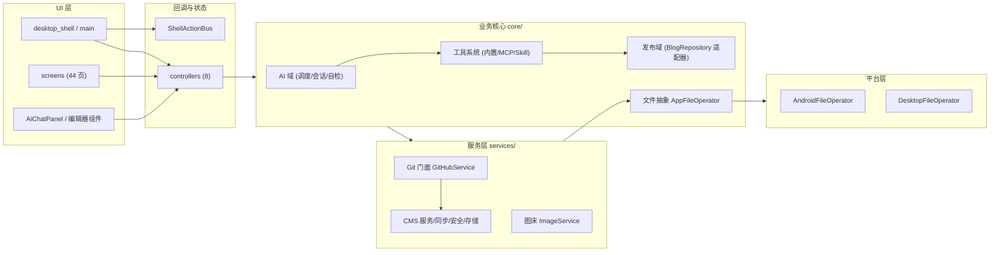
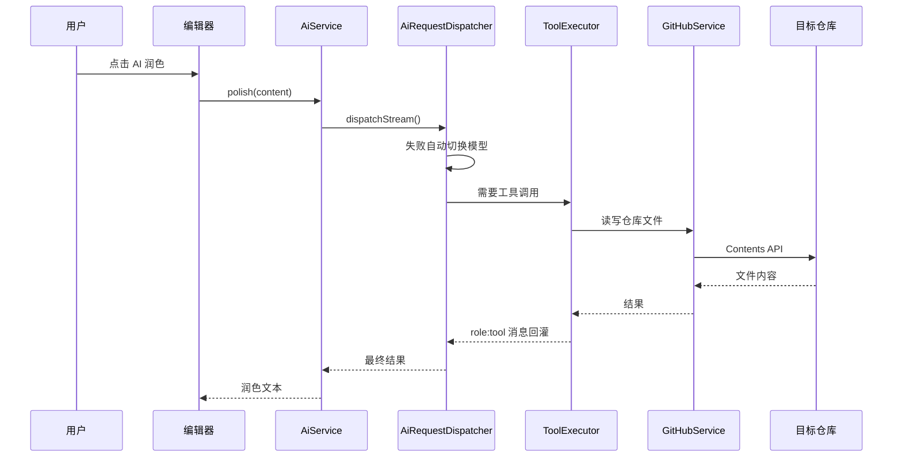
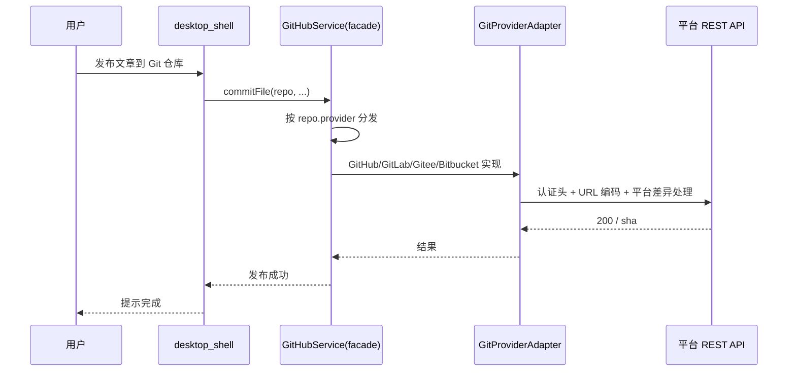

# 拓墨（Hexo）系统架构

## 概述

拓墨是一款 AI 驱动的 Markdown 写作与博客发布工具，面向博客作者与内容创作者，覆盖 Android / iOS / Web / Windows / macOS / Linux 全平台。它将「写作、AI 辅助、多平台发布、图床、站点管理、数据同步与安全」整合进一个统一工作台：用户用 Markdown 完成写作，交给 AI 润色续写，一键发布到 GitHub / GitLab / Gitee / Bitbucket 托管的 Hexo / Hugo / Jekyll 等静态博客，或通过 REST API 发布到 WordPress / Ghost / Typecho 动态 CMS。

系统由七大能力域构成：AI 写作域（多模型调度、7 类会话、工具调用闭环）、多平台发布域（Git 四平台适配 + 静态/动态博客仓库适配）、图床与资源域、数据安全域（AES-256-GCM 加密、站点隔离、版本快照、回收站、冲突解决）、同步域（GitHub 云同步 / WebDAV / 局域网 P2P）、工具系统（内置工具 / Skill / MCP 服务器）以及桌面外壳（窗口、托盘、全局快捷键、多模式布局）。

架构上采用分层 + 门面模式：业务核心（`lib/core/`）与 UI（`lib/screens/`、`lib/desktop/`）解耦，全部文件操作经 `AppFileOperator` 抽象（Android 分区存储 / 桌面直读），全部 Git 操作经 `GitHubService` 门面按平台分发到 `GitProviderAdapter` 实现。

## 技术栈

**语言与运行时**
- Dart / Flutter（SDK `>=3.10.7 <4.0.0`，环境 Flutter 3.44.9）
- 目标平台：Android、iOS、Web、Windows、macOS、Linux（桌面）

**框架与状态管理**
- Flutter（Material Design）
- `provider` 状态管理
- 编辑器自研分层：`DocumentController`（纯数据层）+ `EditorController`（视图状态层），对标 VS Code MVVM

**数据存储**
- SQLite（`sqflite` + `sqflite_common_ffi`）：CMS 草稿、会话快照
- JSON 文件（`~/.hexo_app` 全局存储目录，按分类子文件夹组织）
- `pointycastle` AES-256-GCM 站点数据加密

**Markdown 与内容处理**
- `flutter_markdown` / `markdown`（渲染）
- `flutter_highlight` / `highlight`（代码高亮）
- 自研 `MarkdownDiff` / `ConflictDiffService`（Myers LCS 行级 diff）
- `HtmlToMarkdown`（HTML → Markdown 转换）、`FrontMatterService`（YAML/TOML）
- 自研 Ripgrep + Isolate 全文搜索

**导出能力**
- `printing` + `pdf`（PDF 导出）
- `archive`（DOCX / EPUB 导出，DOCX 导入）

**网络与集成**
- `http`（Git / CMS / WebDAV REST）
- `flutter_inappwebview`（内嵌站点预览）、`webview_flutter`
- `file_picker`、`desktop_drop`（文件选择与拖拽）
- `url_launcher`、`share_plus`、`package_info_plus`

**桌面集成**
- `window_manager`（自定义标题栏 / 窗口管理）
- `system_tray` / `tray_manager`（系统托盘）
- 全局快捷键（`CallbackShortcuts` + 自定义覆盖）

**CI/CD**
- GitHub Actions（`build.yml`）：Web 构建 + Android APK 产物

**外部服务**
- Git 托管：GitHub、GitLab、Gitee、Bitbucket（Contents / Files / Repository 等 REST API）
- 动态 CMS：WordPress REST、Ghost Admin API、Typecho（SecureApi / Restful / FastApi 三插件）
- 云同步：GitHub 私有仓库、WebDAV 服务器
- AI：12 个预置 Provider（OpenAI / DeepSeek / 通义 / GLM / Kimi / 豆包 / Gemini / Claude 等），OpenAI 兼容协议

## 项目结构

```
lib/
├── main.dart                # 入口 + _RootShellState 核心状态（生命周期/会话/导航）
├── desktop/                 # 桌面外壳（25 文件）
│   ├── desktop_main.dart    # 桌面入口：托盘/快捷键/拖拽导入/窗口管理
│   ├── desktop_shell.dart   # 桌面主界面（8448 行，聚合 30+ 服务）
│   ├── shell_action_bus.dart# 统一回调总线（消除 37+ 回调地狱）
│   └── widgets/             # 22 个桌面组件（标题栏/左导航/编辑器区/右抽屉/状态栏…）
├── screens/                 # 44 个功能页面
├── services/                # 42 个服务（Git/CMS/AI/同步/安全/存储）
├── models/                  # 21 个数据模型
├── controllers/             # 8 个控制器（文档/编辑/布局/同步/站点/UI 状态…）
├── mixins/                  # 10 个 State 扩展 part（发布/同步/设置/AI/仓库…）
├── core/                    # 业务核心（与 UI 解耦）
│   ├── ai/                  # AI 会话/模型调度/自检/迁移/工具创建（11 文件）
│   ├── tools/               # 工具系统：内置工具/MCP/Skill/执行器/校验器（13 文件）
│   ├── repository/          # 博客仓库适配层（8 文件）
│   ├── file_manager/        # AppFileOperator 文件操作抽象
│   ├── task/                # Agent 任务模型
│   ├── diff/                # MarkdownDiff 行级 diff
│   ├── template_engine/     # 模板解析引擎
│   ├── utils/               # 路径/字数统计工具
│   └── constant/            # 应用常量
├── platform/                # 平台文件操作实现
│   ├── android/             # AndroidFileOperator（分区存储/SAF/MediaStore）
│   └── desktop/             # DesktopFileOperator（本地直读）
├── widgets/                 # 独立公开组件（字数徽标/AI 对话面板…）
├── theme/                   # 主题控制器与配色
├── l10n/                    # 应用本地化
└── examples/                # 使用示例
```

**入口点**
- `lib/main.dart` — 全平台入口，`_RootShellState` 状态类
- `lib/desktop/desktop_main.dart` — 桌面端入口（托盘、快捷键、拖拽导入）
- CI：`.github/workflows/build.yml` — Web + APK 构建

## 子系统

### 1. AI 写作域
**目的**: 多模型 AI 写作、对话、内容审计与主题开发。
**位置**: `lib/core/ai/`、`lib/services/ai_service.dart`
**关键文件**: `ai_request_dispatcher.dart`（流式分发/故障切换/工具循环）、`ai_session_manager.dart`（7 类会话 System Prompt 工厂）、`ai_model_manager.dart`（模型 CRUD/密钥池轮转/连通性检测）、`ai_self_checker.dart`（两级自检）、`theme_migration_service.dart`（跨框架主题迁移）
**依赖**: `tools/`（工具执行）、`services/`（Git/CMS 读写）
**被依赖**: 6 个 AI 会话 Screen、`agent_workbench_screen.dart`、`ai_chat_panel.dart`

### 2. 多平台发布域
**目的**: 将文章发布到 Git 托管静态博客或动态 CMS。
**位置**: `lib/services/git_*.dart`、`lib/core/repository/`
**关键文件**: `github_service.dart`（门面）、`git_providers.dart`（GitHub/GitLab/Gitee/Bitbucket 实现）、`git_provider_adapter.dart`（抽象接口）、`static_blog_repository.dart`、`wordpress_adapter.dart`、`ghost_adapter.dart`、`typecho_adapter.dart`（及 Restful/FastApi 变体）、`site_manager.dart`（工厂中枢）、`static_blog_batch_publish_service.dart`（批量发布）
**依赖**: `models/`（RepoConfig/BlogSiteConfig/GitProviderType）
**被依赖**: 发布相关全部 Screen、AI 工具、图床

### 3. 图床与资源域
**目的**: 图片上传、图床管理、死链检测与 URL 替换。
**位置**: `lib/services/image_service.dart`、`lib/screens/image_bed_screen.dart`
**关键文件**: `image_service.dart`（压缩/上传/按图床平台路由）、`image_bed_screen.dart`（浏览/删除/CDN 链接/死链扫描/URL 替换）
**依赖**: Git 多平台层（图床跟随仓库平台）
**被依赖**: 编辑器（图片插入）

### 4. 数据安全域
**目的**: 数据加密、站点隔离、版本快照、回收站与冲突解决。
**位置**: `lib/services/`
**关键文件**: `site_encryption_service.dart`（AES-256-GCM）、`site_isolation_service.dart`、`version_snapshot_service.dart`、`recycle_bin_service.dart`、`conflict_diff_service.dart`
**依赖**: `core/file_manager/`（文件抽象）
**被依赖**: 编辑器、移动端快照/回收站/冲突页

### 5. 数据同步域
**目的**: 多端数据互通（手机 ↔ 桌面）。
**位置**: `lib/services/`
**关键文件**: `cloud_sync_service.dart`（GitHub 私有仓库 + WebDAV 后端）、`webdav_service.dart`、`p2p_sync_service.dart` + `p2p_mdns_service.dart`（局域网 mDNS 发现）、`sync_service.dart`（CMS 双向同步状态机）
**依赖**: 存储层、`models/`
**被依赖**: `sync_settings_screen.dart`、`p2p_sync_screen.dart`、`sync_screen.dart`

### 6. 工具系统
**目的**: 让 AI 具备工具调用能力（内置 / Skill / MCP）。
**位置**: `lib/core/tools/`
**关键文件**: `builtin_tools.dart`（21 个内置工具：Web 搜索四引擎、文件读写、Git 快照/回滚/克隆、Skill/模板管理）、`remote_cms_tools.dart`（16 个 CMS 工具）、`tool_executor.dart`（执行器）、`tool_registry.dart`（注册表）、`mcp_runtime.dart`（AI 指令运行时）、`mcp_server.dart`（外部 MCP 服务器）、`skill_manager.dart`、`tool_schema_validator.dart`（危险操作黑名单校验）、`instruction_parser.dart`（指令解析）
**依赖**: `core/ai/`（凭据脱敏/工具创建）、`repository/`
**被依赖**: `ai_chat_panel.dart`、`ai_request_dispatcher.dart`

### 7. 桌面外壳
**目的**: 桌面端完整工作台体验。
**位置**: `lib/desktop/`
**关键文件**: `desktop_main.dart`、`desktop_shell.dart`、`shell_action_bus.dart`
**依赖**: 全部服务域
**被依赖**: 桌面平台入口

## 图表






