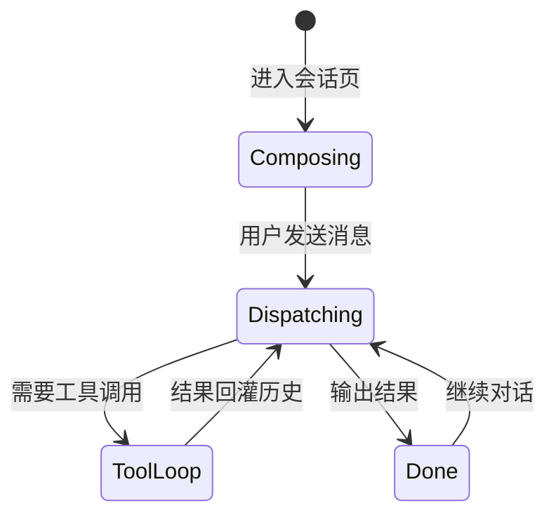

# AiSession（AI 会话）

AiSession 是拓墨 AI 能力的最小上下文单元，它把"会话类型 → System Prompt → 动态上下文 → 调度执行"串成完整链路。

## 什么是 AiSession？

`AiSessionType` 定义 7 类会话：文章（article）、页面（page）、主题开发（theme）、主题迁移（themeMigration）、站点巡检（audit）、应用 UI 设计（appDesign）、模板（template）。`AiSessionManager` 为每类会话组装 System Prompt（全局内核总控 Prompt + 场景独立 Prompt + 运行时动态上下文 JSON），由 `AiRequestDispatcher` 执行流式/非流式请求，支持模型故障切换与最多 12 轮工具调用循环。

**关键特征**:
- 每类会话有专属 System Prompt 与内置 Prompt 常量（润色/续写/摘要/大纲/代码/改写等）
- 会话上下文经 `SiteDispatcherManager` 按站点隔离
- 自检链路：本地快速检查（HTML 标签闭合、CSS 路径、YAML/TOML、代码块、EJS 标签）+ AI 深度自检

## 代码位置

| 方面 | 位置 |
|------|------|
| 会话类型与 Prompt 工厂 | `lib/core/ai/ai_session_manager.dart` |
| 请求调度 | `lib/core/ai/ai_request_dispatcher.dart` |
| 模型管理 | `lib/core/ai/ai_model_manager.dart` |
| 自检 | `lib/core/ai/ai_self_checker.dart` |
| 站点隔离 | `lib/core/ai/site_dispatcher_manager.dart` |
| 会话 UI | `lib/screens/ai_*_screen.dart`（6 页）+ `widgets/ai_chat_panel.dart` |

## 结构

```dart
enum AiSessionType { article, page, theme, themeMigration, audit, appDesign, template }

class AiSessionManager {
  static String getSystemPrompt(AiSessionType type);
  static String buildContextJson(...);
  static const selfCheckPrompt, polishPrompt, continueWritePrompt, /* ... */;
}
```

## 生命周期



| 状态 | 描述 |
|------|------|
| Composing | 组装 System Prompt 与上下文 |
| Dispatching | 请求分发，失败自动切换备选模型 |
| ToolLoop | 非流式工具调用循环（≤12 轮），结果回灌历史 |
| Done | 输出完成，可继续下一轮 |

## 关系

| 关联概念 | 关系 | 描述 |
|---------|------|------|
| AiRequestDispatcher | 执行 | 每个会话共享调度器，处理流式/切换/工具循环 |
| SiteDispatcherManager | 隔离 | 每站点独立调度器实例，防串场 |
| ToolSystem | 调用 | 会话可调用内置/Skill/MCP 工具 |
