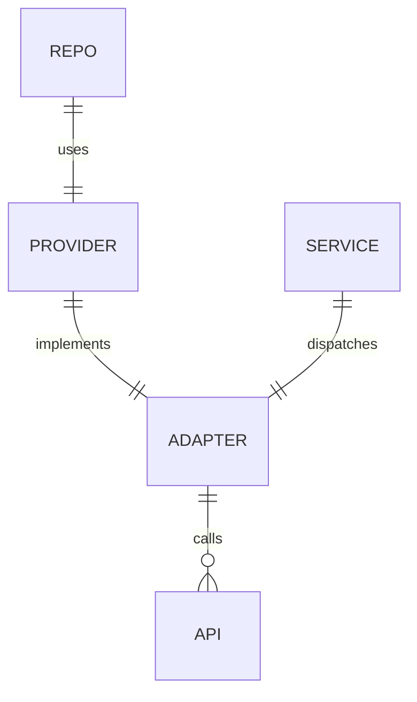

# GitProvider（Git 平台适配层）

GitProvider 是拓墨对多 Git 托管平台的统一抽象，它让"发布到 GitHub"与"发布到 GitLab/Gitee/Bitbucket"对上层透明。

## 什么是 GitProvider？

`GitProviderType` 枚举定义支持的平台（github / gitlab / gitee / bitbucket），`GitProviderAdapter` 定义统一接口，四个 `*Provider` 类封装各平台差异（认证头、URL 编码、REST 端点、返回结构）。`GitHubService` 作为门面，按 `RepoConfig.provider` 分发到对应实现。

**关键特征**:
- 认证差异：GitHub 用 `Bearer` token；GitLab/Gitee 用 OAuth token；Bitbucket 用 `username:app_password` Basic
- 编码差异：GitHub/Gitee 逐段编码（保留 `/`），GitLab 整条编码（files API 要求）
- 写操作语义统一（返回 sha），图床二进制上传经 form 编码（Bitbucket 易损坏为已知限制）

## 代码位置

| 方面 | 位置 |
|------|------|
| 枚举/模型 | `lib/models/git_provider.dart` |
| 抽象接口 | `lib/services/git_provider_adapter.dart` |
| 实现 | `lib/services/git_providers.dart` |
| 门面 | `lib/services/github_service.dart` |
| HTTP 工具 | `lib/services/git_http.dart` |

## 结构

```dart
enum GitProviderType { github, gitlab, gitee, bitbucket }

abstract class GitProviderAdapter {
  GitProviderType get type;
  String get apiBase;
  Future<GitAccount> getUser(String token);
  Future<GitHubFileItem> listContents(...);
  Future<String> readFile(...);
  Future<String> writeFile(...);
  Future<bool> deleteFile(...);
  Future<String?> rawUrl(...);
  // ... 共 12 个方法
}
```

## 不变量

1. **向后兼容**: `GitHubService` 类名与全部历史方法签名不可变（约 36 处调用点依赖）。
2. **序列化回退**: 缺失 `provider` 字段的历史配置一律回退 `github`。
3. **Gitee 双通道**: Gitee 必须同时携带 `access_token` query 参数，纯 header 认证不可靠。

## 关系



| 关联概念 | 关系 | 描述 |
|---------|------|------|
| RepoConfig | 使用 | 每个仓库配置绑定一个 provider |
| GitHubService | 分发 | 门面按 provider 选择适配器 |
| ImageService | 复用 | 图床跟随图床仓库自己的平台 |
