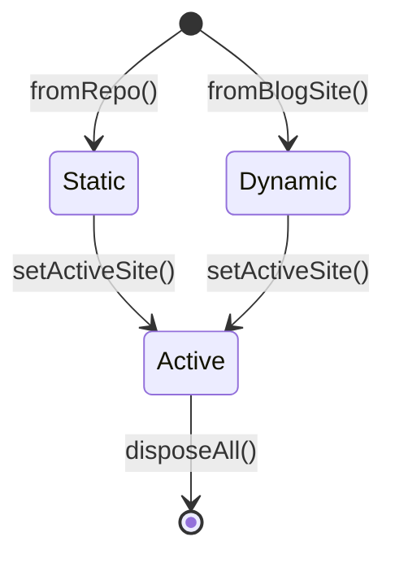

# SiteIdentity（站点统一身份）

SiteIdentity 让拓墨把"Git 托管的静态博客仓库"和"REST API 的动态 CMS"统一为一种"站点"概念，是编辑器、发布、AI 工具三层共用的抽象。

## 什么是 SiteIdentity？

`SiteIdentity` 是站点的统一身份标识，由 `SiteManager` 管理。一个站点要么是静态仓库（Hexo/Hugo/Jekyll 等，数据经 `GitHubService` 读写），要么是动态 CMS（WordPress/Ghost/Typecho，数据经对应 `BlogRepository` 适配器读写）。`SiteManager` 通过工厂按类型创建适配器，并用 `SiteOperation` 做静态/动态操作的双层防护路由。

**关键特征**:
- 工厂方法 `fromRepo()` / `fromBlogSite()` 分别从仓库配置与站点配置构造
- 活跃站点切换时自动清理适配器缓存，并处理并发互斥
- AI 会话按站点隔离（`SiteDispatcherManager`），避免多站点上下文串场

## 代码位置

| 方面 | 位置 |
|------|------|
| 站点管理器 | `lib/core/site_manager.dart` |
| 站点身份 | `SiteIdentity` / `SiteType`（同文件） |
| 仓库适配器 | `lib/core/repository/blog_repository.dart` + 6 个实现 |
| 静态仓库配置 | `lib/models/repo_config.dart` |
| 动态站点配置 | `lib/models/blog_site_config.dart` |

## 结构

```dart
enum SiteType { static, dynamic }

enum SiteOperation { createPost, updatePost, deletePost, uploadMedia, /* ... */ }

class SiteManager {
  SiteIdentity? get currentSiteIdentity;
  BlogRepository get currentAdapter;
  bool canExecuteOperation(SiteOperation op);
  Future<void> setActiveSite(SiteIdentity id);
  BlogRepository getAdapter(BlogSiteConfig config); // 工厂
}
```

## 不变量

1. **仅静态站点可设默认**：`setDefaultSite` 对动态站点拒绝。
2. **写操作防护**：只读接口（如 Typecho FastApi）的写操作经 `SiteOperation` 拦截。
3. **站点切换隔离**：切换站点必须走 `setActiveSite`，保证适配器与 AI 上下文同步更新。

## 生命周期



| 状态 | 描述 |
|------|------|
| Static | 静态仓库身份，适配器为 StaticBlogRepository + Git 门面 |
| Dynamic | 动态 CMS 身份，适配器为 WordPress/Ghost/Typecho 之一 |
| Active | 当前会话活跃站点，上下文与适配器就绪 |
