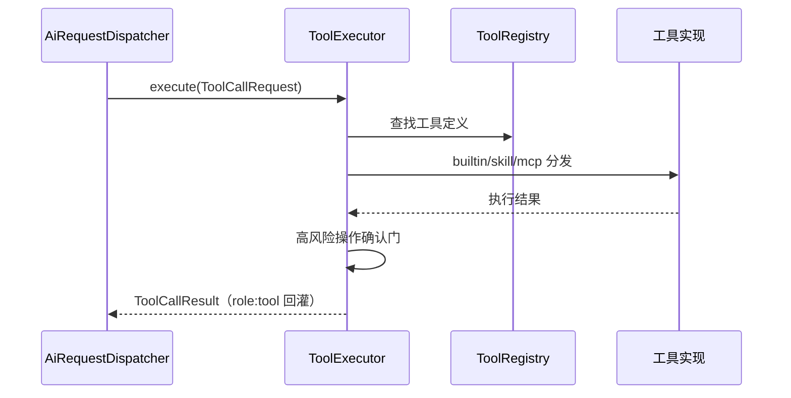

# ToolSystem（工具系统）

ToolSystem 是拓墨让 AI"能动手做事"的能力层：AI 不仅能写，还能读仓库、搜索网页、操作 CMS、管理文件。

## 什么是 ToolSystem？

工具系统统一管理三类工具：**内置工具**（21 个，静态代码实现）、**Skill**（用户/AI 定义的可复用技能）、**MCP 工具**（从外部 MCP 服务器 `tools/list` 拉取）。`ToolRegistry` 为注册表，`ToolExecutor` 为执行器，`McpRuntime` 解析 AI 输出中的指令标记（`NEW_MCP` / `SKILL_RUN` / `MCP_CALL` 等）并驱动流水线执行。高风险操作有确认门，危险操作有黑名单校验（`ToolSchemaValidator`）。

**关键特征**:
- 三种协议解析：OpenAI / Anthropic / OpenAI-Responses
- 工具结果统一格式化为 `role:tool` 消息，防止 `tool_calls must be followed by tool messages` 400
- 工具作用域：全局 / 站点私有，可见性按当前站点过滤
- 凭据脱敏：`TokenVault` 掩码凭据只进 AI 上下文，真实值只注入服务层

## 代码位置

| 方面 | 位置 |
|------|------|
| 工具模型 | `lib/core/tools/tool_entity.dart` |
| 内置工具 | `lib/core/tools/builtin_tools.dart`（21 个） |
| CMS 工具 | `lib/core/tools/remote_cms_tools.dart`（16 个） |
| 执行器 | `lib/core/tools/tool_executor.dart` |
| 注册表 | `lib/core/tools/tool_registry.dart` |
| 运行时 | `lib/core/tools/mcp_runtime.dart` |
| MCP 服务器 | `lib/core/tools/mcp_server.dart` |
| 技能管理 | `lib/core/tools/skill_manager.dart` |
| 校验器 | `lib/core/tools/tool_schema_validator.dart` |
| 指令解析 | `lib/core/tools/instruction_parser.dart` |
| 凭据脱敏 | `lib/core/ai/token_vault.dart` |

## 结构

```dart
enum ToolType { builtin, skill, mcp }
enum ToolScope { global, site }

class ToolExecutor {
  Future<ToolCallResult> execute(ToolCallRequest req);
  static String formatToolResultsForAi(results); // role:tool 消息
}
```

## 执行流程



## 不变量

1. **确认门**: 高风险工具未注入确认回调时直接拒绝。
2. **黑名单**: 工具定义含 `rm -rf`、`drop database`、`force push` 等危险关键词时校验失败。
3. **结果兜底**: 工具异常被包装为失败结果，保证工具调用消息链完整。

## 关系

| 关联概念 | 关系 | 描述 |
|---------|------|------|
| AiSession | 被调用 | 会话经调度器调用工具 |
| AiToolManager | 创建 | AI 生成的工具定义经其校验并持久化 |
| SiteIdentity | 路由 | CMS 工具按站点类型拦截路由 |
