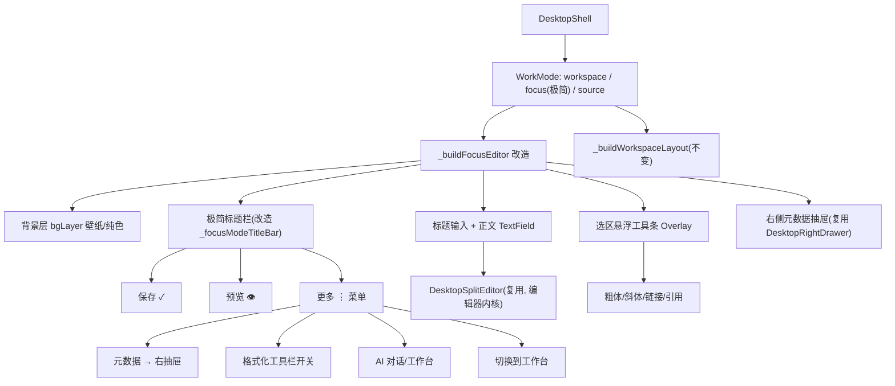

# 桌面端极简写作模式（改造 focus）

Feature Name: desktop-minimal-writing
Updated: 2026-09-06

## Description

将桌面端默认写作体验对齐手机端「清爽范式」。改造现有 `WorkMode.focus`（当前为
MarkText 遮罩式专注模式）为「极简写作模式」：极简标题栏 + 背景层 + 标题输入框 +
正文编辑区，大留白、无中框感。FrontMatterCard、仓库选择器、类型切换、19-chip
工具栏、Front-matter 面板、多标签页栏、底部状态条全部默认隐藏；通过右上角
「更多⋮」菜单、正文选区悬浮工具条与 `Ctrl+Shift+E` 呼出高级能力。功能只隐藏、不删除。

## Architecture



## Components and Interfaces

### 1. `_buildFocusEditor` 重构（lib/desktop/desktop_shell.dart）

结构改为：

```
Stack
├─ Positioned.fill: bgLayer          # 复用 _deskUseWallpaper/_deskBgColor（壁纸延续）
├─ SingleChildScrollView(留白 80h/64v, maxWidth 860 居中)
│   └─ Column
│       ├─ 标题 TextField            # 32px w700，色 _deskTextColor
│       ├─ 细分隔线
│       └─ 正文 TextField            # 当前行高亮保留，色 _deskTextColor
├─ 选区悬浮工具条 Overlay
└─ 底部打字机指示 chip（保留，轻量）
```

- 移除：外层 `Container(surfaceBase)` 双层背景（改用 bgLayer）、作者/日期/字数元信息
  chips、右侧预览内嵌面板（预览走极简标题栏「预览👁」，仍复用右抽屉）。
- 字色：标题与正文文字色全部改 `_deskCustomBg ? _deskTextColor : (isDark? 白 : 常规)`，
  与 `_buildEmbeddedEditor` 保持一致（R1.4）。
- 背景：`_deskCustomBg`（bgMode!=0）时正文区透明，露出壁纸/纯色；纯白模式保持主题底色。

### 2. `_focusModeTitleBar` 改造

```
[☰ 折叠侧边栏] [项目名]          [保存✓][预览👁][更多⋮] [窗口控件]
```

- 左侧 ☰ → `_toggleLeftPanel`；项目名 = 站点/仓库名。
- 右侧保存✓（`_saveLocal`）、预览👁（切换右抽屉预览 tab / 打开预览视图）、更多⋮。
- 更多⋮ 菜单项：
  - 元数据（打开右抽屉 `RightDrawerTab.frontMatter`，已绑定 tags/categories/cover）
  - 格式化工具栏（展开内嵌工具栏，见 §3 兜底）
  - AI 对话 / AI 工作台
  - 发布、同步、主题
  - 切换到完整编辑模式（`_switchWorkMode(WorkMode.workspace)`）

### 3. 选区悬浮工具条

- 监听 `_doc.contentCtrl`（`addListener`），取 `selection`。
- 选中非空且非折叠时，通过正文 TextField 的 `GlobalKey` 定位选区矩形
  （`RenderEditable.getEndpointsForSelection` 或 `getLocalRectForCaret`），
  在选区上方用 `OverlayEntry` 渲染迷你工具条：粗体/斜体/链接/引用 + 「更多」
  （更多展开完整 `_toolChip` 集合）。
- 取消选区或点击外部即移除 OverlayEntry。
- 兜底入口：更多⋮菜单「格式化工具栏」开关在标题下方展开完整工具栏（复用现有
  `_toolChip` 集合，R3.2）。

### 4. 侧边栏折叠持久化

- `LayoutController` 增加 `_leftPanelExpanded` 的持久化：接入
  `UiStateController`（新增 `leftPanelCollapsed` 字段，随 settings 存储），
  启动时恢复、变更时写回（R5.3）。
- 进入极简模式时 `collapseLeftPanel()`（R5.1）；☰ 点击展开（R5.2，现有 `_toggleLeftPanel`）。

### 5. 模式切换快捷键

- 全局快捷键 `Ctrl+Shift+E`：`WorkMode.focus` ↔ `WorkMode.workspace`（R6.1）。
  快捷键注册沿用现有 `Shortcuts/Actions` 或 KeyEvent 监听（`desktop_shell` 已有
  快捷键体系，追加一组）。
- `Escape` 语义保留：右抽屉 → 极简 → 源码逐级退出（R6.2）。

## Data Models

- `UiStateController`（settings.ui）：新增字段 `leftPanelCollapsed: bool`，
  默认 false（完整模式下默认展开；进入极简模式时置 true 且写回）。
- 无新增持久化模型。极简模式的开关状态即 `WorkMode`（内存态），不落盘——
  每次打开应用默认工作台，进入文章写作默认切极简（R1.1）。

## Correctness Properties

1. 极简模式下不渲染：FrontMatterCard、仓库选择器、类型切换、19-chip 工具栏、
   Front-matter 面板、多标签页栏、底部状态条。
2. 极简模式下标题与正文文字色与背景/壁纸亮度联动，纯白背景回落主题默认色。
3. 切换模式不丢失 `_doc` 内容与未保存改动（同一控制器实例）。
4. 右抽屉元数据字段（tags/categories/cover）与极简模式共享同一 `_doc` 控制器，
   保存链路不变。

## Error Handling

- 壁纸读取失败：bgLayer 回落纯色（既有 `errorBuilder`/`_deskBgColor` 机制）。
- 悬浮工具条定位异常（选区不可见/窗口缩放过小）：隐藏工具条并静默失败，不抛出。
- 侧边栏持久化写盘失败：忽略，回退内存态（不阻塞启动）。

## Test Strategy

- `flutter analyze`（仅关注改动文件，过滤 `_archive/` 与平台插件既有 error）。
- 手动验证（Windows 桌面）：
  1. 打开新文章默认进入极简模式，仅见标题+正文+背景层。
  2. 更多⋮ → 元数据打开右抽屉，标签/分类/封面可编辑且保存生效。
  3. 选中正文文本弹出悬浮工具条，粗体/斜体/链接生效；取消选区即隐藏。
  4. `Ctrl+Shift+E` 极简 ↔ 工作台往返，内容不丢失。
  5. ☰ 折叠/展开侧边栏，重启后保持。
  6. 切换 bgMode（纯白/纯黑/壁纸），极简模式背景与字色同步自适应。
- 回归：工作台模式（workspace）UI 不受影响，`source` 模式不受影响。

## References

[^1]: (lib/desktop/desktop_shell.dart#L10853) - `_buildFocusEditor` 现实现（MarkText 遮罩式）
[^2]: (lib/desktop/desktop_shell.dart#L10676) - `_focusModeTitleBar` 现实现
[^3]: (lib/desktop/desktop_shell.dart#L2211) - `_buildEmbeddedEditor`（bgLayer/字色/工具栏参照）
[^4]: (lib/controllers/layout_controller.dart#L58) - `_leftPanelExpanded` 无持久化
[^5]: (lib/desktop/widgets/desktop_split_editor.dart) - 编辑器内核（分屏/源码/预览）
[^6]: (lib/desktop/widgets/left_panel.dart#L479) - 左面板折叠按钮
[^7]: (lib/mixins/editor_ui_ext.dart#L572) - 手机端「更多⋮」底部弹窗（收纳范式参照）
