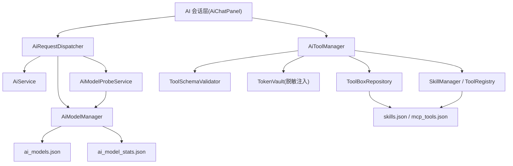

# AI 工具编排与模型调度器

Feature Name: ai-tool-and-model-orchestration
Updated: 2026-08-06

## Confirmed Decisions（2026-08-06）

1. 工具管理与模型调度合并为一个 spec 推进（不分拆独立评审）。
2. 危险操作黑名单采用「关键词 + 正则」双层实现，拦截 rm -rf、无 WHERE 的 DELETE、force push、覆盖 `_config` 配置、根路径写操作等；黑名单默认值集中在 `ToolSchemaValidator` 常量表，便于维护与扩展。
3. AI 自动保存工具开关默认开启（`aiAllowAutoSaveTools = true`），用户可在设置页关闭；关闭时仅返回定义供人工审查。
4. 自动择优模式默认开启（`aiAutoOptimalModel = true`），用户可手动固定模型临时关闭。

## Description

为 Flutter Hexo 博客 App 的 AI 会话模块落地两项能力：

1. **AiToolManager**：安全读取当前站点令牌（脱敏环境注入）、校验并持久化 AI 生成的 MCP/Skill 工具、实现站点私有/全局公用权限隔离，工具箱来源标记与人工最终控制。
2. **AiModelProbeService + AiRequestDispatcher 增强**：后台探测各模型延迟维护优先级队列；超时/报错时保留完整上下文自动切换备选模型；UI 回写当前模型与切换记录；工具格式跨模型适配。

## Architecture



架构说明：

- **AiRequestDispatcher** 是所有 AI 会话的唯一调度入口，负责超时检测、自动择优、故障切换、上下文透传与工具格式适配。
- **AiToolManager** 是工具生成链路的中枢：令牌脱敏读取 → 定义校验 → 持久化 → 权限注入。
- **AiModelProbeService** 独立于调度器后台运行，探测结果写入模型统计文件，调度器在择优时读取。
- 现有 `McpRuntime` 负责解析 AI 输出的 NEW_MCP / NEW_SKILL 指令文本，新增校验与入库流程挂在 `McpRuntime` 的保存动作之前。

## Components and Interfaces

### 1. TokenVault（令牌脱敏读取）

新增 `lib/core/ai/token_vault.dart`，负责从当前活跃站点提取令牌并做脱敏。

```dart
/// 站点凭据（脱敏后供 AI 感知存在性，真实值仅供服务层调用）
class SiteCredentials {
  final String kind;         // git / wordpress / ghost / typecho
  final String maskedToken;  // 掩码表示，如 "ghp_****abcd"
  final Map<String, String> envName; // 环境变量名（真实值注入用）
}
```

- 输入：`SiteManager` 当前活跃站点（`RepoConfig` 或 `BlogSiteConfig`）。
- 输出：`SiteCredentials`；真实令牌仅写入工具调用环境（如 `ToolCallRequest.credentials`），绝不进入对话消息。

### 2. ToolSchemaValidator（两层校验）

新增 `lib/core/tools/tool_schema_validator.dart`：

```dart
class ToolSchemaValidator {
  ValidationResult validateMcp(Map<String, dynamic> json);
  ValidationResult validateSkill(Map<String, dynamic> json);
  ValidationResult checkDangerousOperation(Map<String, dynamic> json);
}
```

- **JSON Schema 格式校验**：校验 `meta.name`、`meta.description`、`params` 数组结构（key/type/required 合法类型）、Skill 的 `steps` 结构。
- **危险操作黑名单检测**：正则与关键词匹配删除全部文件（`rm -rf`、`DELETE FROM` 无 WHERE、`force push`、清空仓库、覆盖 `_config` 配置、`/` 根路径写操作等）。命中即拒绝保存并返回 `blockedBy` 原因。
- 返回结构化 `ValidationResult { pass, errors[], blockedBy }`，供 `McpRuntime` 回传给 AI 修改。

### 3. AiToolManager

新增 `lib/core/ai/ai_tool_manager.dart`，为工具生成链路中枢：

```dart
class AiToolManager {
  final TokenVault _vault;
  final ToolSchemaValidator _validator;
  final SkillManager _skillManager;
  final ToolBoxRepository _repository;

  Future<AiToolCreateResult> createToolFromAi(
    Map<String, dynamic> definition, {
    required String siteId,
    required bool allowAutoSave,
  });
}
```

职责：
1. 调用 `ToolSchemaValidator` 双重校验；
2. 校验失败返回错误给 AI；
3. 校验通过后写入 `ToolBoxRepository`（区分站点私有/全局公用，标记来源 `ai`）；
4. 当前会话通过 `ToolRegistry` 立即加载。

### 4. ToolBoxRepository（工具持久化 + 作用域）

新增 `lib/core/tools/toolbox_repository.dart`，基于现有 `SkillManager` 的 `skills.json` / `mcp_tools.json` 扩展字段：

- `ToolEntity` 增加 `scope`（`sitePrivate` / `global`）与 `source`（`user` / `ai`）字段，见 `lib/core/tools/tool_entity.dart`。
- `scope == sitePrivate` 时，`SkillManager` 的 `openAiTools` / `enabledTools` 需按当前会话 `siteId` 过滤，仅注入本站点工具。
- 提供 `listByScope(siteId)`、`toggleEnabled(id, bool)`、`setScope(id, scope)` 等接口。

### 5. AiModelProbeService（模型探测）

新增 `lib/core/ai/ai_model_probe_service.dart`：

```dart
class AiModelProbeService {
  Future<void> probeAll({required AiModelManager manager});
  Future<List<AiModelEntity>> getPriorityQueue({
    required AiModelManager manager,
    bool autoOptimal = true,
    AiModelEntity? fixedModel,
  });
}
```

- 后台对每个已启用模型发起 `GET {apiBase}/v1/models`（复用 `AiModelManager.fetchModelsFromProxy` 探测逻辑）或轻量 chat 请求，记录 RT。
- 结果通过 `AiModelManager.recordCall` 写入 `ai_model_stats.json`。
- `getPriorityQueue` 结合延迟、成功率与用户优先级字段排序；`autoOptimal=false` 时返回固定模型。

### 6. AiRequestDispatcher 增强

`lib/core/ai/ai_request_dispatcher.dart` 在现有 `dispatch` / `dispatchStream` 基础上增强：

- **可配置超时**：超时阈值从 `AppSettings` 或 `AiSettings` 读取（默认 25s），替代写死的 `currentModel.timeoutSecond`。
- **上下文完整继承**：现有 `_chatHistory`（含 tool_calls）已保证上下文不丢，需在切换时确认 messages 数组原样透传。
- **切换事件回调**：新增 `void Function(SwitchEvent)? onModelSwitched`，`SwitchEvent { fromModel, toModel, reason }`。
- **最大切换次数**：由 `maxRetries` 参数控制，与全局配置联动。
- **工具格式适配**：新增 `ToolFormatAdapter`（`lib/core/tools/tool_format_adapter.dart`），将统一 `ToolEntity` 转换为各模型厂商的 tools 格式；不同模型切换时工具定义保持同一份抽象。

### 7. McpRuntime 接入点

`lib/core/tools/mcp_runtime.dart` 的 `_handleNewMcp` / `_handleNewSkill` 在调用 `SkillManager.registerMcpTool` / `createSkill` 之前插入 `AiToolManager` 校验；校验失败时返回 `McpRuntimeResult(success: false, error: 校验原因)`，不落库。

### 8. UI 改动

- `lib/widgets/ai_chat_panel.dart`：右上角显示当前模型；自动模式标注「自动择优」；`SwitchEvent` 展示切换提示条；头部记录模型变更。
- `lib/screens/tool_library_screen.dart`：新增来源标记（用户手动 / AI 生成）、禁用开关、删除入口。
- `lib/screens/settings_screen.dart` / AI 设置：新增请求超时、最大切换次数、允许 AI 自动保存工具总开关、自动择优模式开关。

## Data Models

### ToolEntity 扩展（lib/core/tools/tool_entity.dart）

```dart
enum ToolScope { sitePrivate, global }
enum ToolSource { user, ai }

// ToolEntity 新增字段
final ToolScope scope;        // 默认 global
final ToolSource source;      // 默认 user
final String? siteId;         // scope==sitePrivate 时所属站点 ID
final String? riskLevel;      // AI 定义中的风险等级
```

### 新增配置项（AiSettings / AppSettings）

| 字段 | 类型 | 默认值 |
|------|------|--------|
| `aiRequestTimeoutSec` | int | 25 |
| `aiMaxSwitchCount` | int | 3 |
| `aiAutoOptimalModel` | bool | true |
| `aiAllowAutoSaveTools` | bool | true |

### 模型统计（复用 ai_model_stats.json）

`ModelStats` 已含 `totalCalls / totalSuccess / totalFail / avgDurationMs / fastestMs`，探测服务直接复用 `AiModelManager.recordCall` 回写。

## Correctness Properties

1. 令牌明文 SHALL NOT 出现在对话消息、`_chatHistory`、日志文件与 `ToolEntity` 定义中。
2. 危险操作黑名单命中工具 SHALL NOT 持久化。
3. 站点私有工具 SHALL 仅在归属站点会话可见，跨站点注入 SHALL 返回无权限。
4. 模型切换后 messages 数组 SHALL 与切换前一致（内容完整继承）。
5. 切换次数 SHALL NOT 超过 `aiMaxSwitchCount`。
6. 自动保存工具关闭时，AI 生成定义 SHALL 不自动落库。
7. 会话结束 / App 重启后，已保存工具 SHALL 从磁盘恢复。

## Error Handling

| 场景 | 处理 |
|------|------|
| 当前站点无令牌 | 返回缺凭据错误，引导到站点设置 |
| JSON Schema 校验失败 | 返回 `ValidationResult.errors`，AI 修改重提 |
| 命中危险黑名单 | 返回 `blockedBy` 拦截原因，不落库 |
| 模型超时 | 触发切换，写切换日志，UI 提示 |
| 全部模型失败 | 终止请求，弹窗提示检查 API 密钥与网络 |
| 上下文超长 | 自动摘要压缩后切换模型 |
| 工具格式不兼容 | ToolFormatAdapter 转换后继续 |

## Test Strategy

1. **TokenVault 单元测试**：掩码正确性、无令牌缺省分支、各站点类型凭据提取。
2. **ToolSchemaValidator 测试**：合法定义通过；非法 JSON Schema 返回错误；危险操作黑名单（`rm -rf`、无 WHERE DELETE、force push、覆盖配置）被拦截。
3. **ToolBoxRepository 测试**：站点私有工具跨站点不可见；来源标记与禁用状态持久化。
4. **AiModelProbeService 测试**：优先级队列按延迟排序；固定模型模式下不探测不排序。
5. **AiRequestDispatcher 测试**：注入 mock 失败模型验证上下文完整继承、切换事件触发、最大重试终止。
6. **UI 测试**：切换提示条、模型变更记录、来源标记展示。
7. 验证命令：`flutter test`。

## References

[^1]: lib/core/ai/ai_request_dispatcher.dart - 现有调度器（含 _chatHistory 上下文持有、dispatch 故障切换）
[^2]: lib/core/ai/ai_model_manager.dart - 模型 CRUD 与 ModelStats 统计
[^3]: lib/core/tools/mcp_runtime.dart - NEW_MCP / NEW_SKILL 指令解析与保存
[^4]: lib/core/tools/skill_manager.dart - skills.json / mcp_tools.json 持久化
[^5]: lib/core/tools/tool_entity.dart - ToolEntity 定义
[^6]: lib/core/site_manager.dart - 站点身份与令牌来源
[^7]: lib/models/repo_config.dart - Git Token 字段
[^8]: lib/models/blog_site_config.dart - WordPress/Ghost/Typecho 凭据字段
[^9]: lib/widgets/ai_chat_panel.dart - 可复用 AI 对话面板
[^10]: lib/screens/tool_library_screen.dart - 工具箱页面
