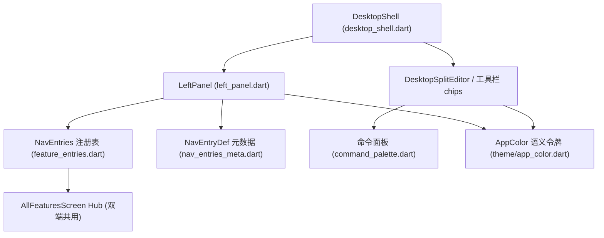

# 桌面端界面收敛与视觉对齐

Feature Name: desktop-ui-redesign
Updated: 2026-09-11

## Description

桌面端信息架构收敛与视觉统一：简易模式侧边栏收敛至高频入口（≤9）、编辑器工具栏
对齐手机端集合、容器样式卡片化。全部改动仅触达桌面壳层（lib/desktop/），
移动端行为保持不变。

## Architecture

现状要点：

- 入口可见性由双端共用注册表 `NavEntries.registry`（feature_entries.dart:71）治理，
  简易模式 `shown` 入口达 16 个，是侧边栏拥挤根因。
- 设计令牌已存在且双端共用：`AppColor`（theme/app_color.dart，语义色单一来源）、
  `AppTheme.lightFromConfig/darkFromConfig`（theme/app_theme.dart）。
  视觉工作为「令牌补齐应用」而非新建主题系统。

## Components and Interfaces

### 1. 侧边栏收敛（R1）

- 位置：lib/desktop/widgets/left_panel.dart + lib/desktop/nav_entries_meta.dart。
- 方案：在 nav_entries_meta.dart 新增桌面端简易模式默认集合
  `kSimpleSidebarDefaults`（高频入口 id 列表，≤9：home、new_article、drafts、
  cloud_sync、site_manager、agent_workbench、image_bed、settings、all_features）。
  left_panel 在简易模式下以该集合为默认可见集，叠加用户 navCustom/siimpleModeExtras
  自定义项。
- 约束：shared 注册表 `NavEntries.registry` 保持不动（移动端零影响）；
  「自定义侧边栏」对话框（showSidebarCustomizeDialog）仍可增删全部入口。

### 2. 编辑器工具栏（R2）

- 位置：lib/desktop/desktop_shell.dart `_buildToolChips`（约 :3192）。
- 方案：保留常用格式化 chips（与手机 `_buildMdToolbar`，editor_ui_ext.dart:1758
  同集合：加粗/斜体/删除线/H1/H2/列表/任务/引用/行内码/代码块/表格/链接/图片/
  分割线/more）；导出（HTML/PDF/DOCX/EPUB/MD 备份）、导入（HTML/DOCX）、批量
  （批量插图/批量工具）、修复（修编码/修路径）、格式化文档等迁入「更多」
  PopupMenuButton。
- 命令面板（command_palette.dart）动作集合保持全量，作为专业工具兜底入口。

### 3. 视觉令牌补齐（R3）

- 位置：left_panel.dart、desktop_shell.dart 顶栏/状态栏/对话框辅助、设置页容器。
- 方案：散落的手写 `Color(0xFF…)` 双分支替换为 AppColor 语义令牌；容器统一为
  卡片样式（圆角 12、1px 描边、12-16 内边距，与移动端卡片一致）；分组标题用
  textMuted 小字号。
- 分批提交，每批一个 UI 面（侧边栏 → 工具栏 → 设置页），避免一次性大改难回归。

## Data Models

- 复用现有 `UiSettings.navCustom`（用户自定义入口集合）与 `simpleModeExtras`
  （optIn 追加项），新增字段为无；`kSimpleSidebarDefaults` 为编译期常量。

## Correctness Properties

1. 任意入口在「Hub、命令面板、更多菜单」三者之一可达（功能零丢失）。
2. `NavEntries.registry` 与移动端共享测试 nav_custom_test 保持通过。
3. 简易模式侧边栏可见入口数 ≤ 9 + 用户自定义追加数。

## Error Handling

- 用户 navCustom 中含已废弃 id：left_panel 按 kNavEntries 存在性过滤，静默忽略。
- 工具栏迁移后旧快捷键不变（快捷键层与工具栏按钮解耦，无需迁移）。

## Test Strategy

- 既有：nav_custom_test.dart 全量回归（双端入口一致）。
- 新增 widget 测试（test/desktop_shell_ui_test.dart）：
  1. 简易模式 LeftPanel 渲染入口数 ≤ 9；
  2. 工具栏含「更多」按钮且菜单含导出 HTML/导入 HTML 动作；
  3. 常用格式化 chips 集合与手机端定义一致（共用常量断言）。
- 手工验收清单：深/浅主题切换、简易/标准模式切换、自定义侧边栏增删。

## References

- lib/desktop/feature_entries.dart:71 入口注册表
- lib/desktop/nav_entries_meta.dart:26 入口元数据
- lib/desktop/widgets/left_panel.dart 侧边栏
- lib/desktop/desktop_shell.dart:3192 工具栏 chips
- lib/mixins/editor_ui_ext.dart:1758 手机工具栏（对齐基准）
- lib/theme/app_color.dart 语义色令牌
- lib/theme/app_theme.dart 共用主题构建器
