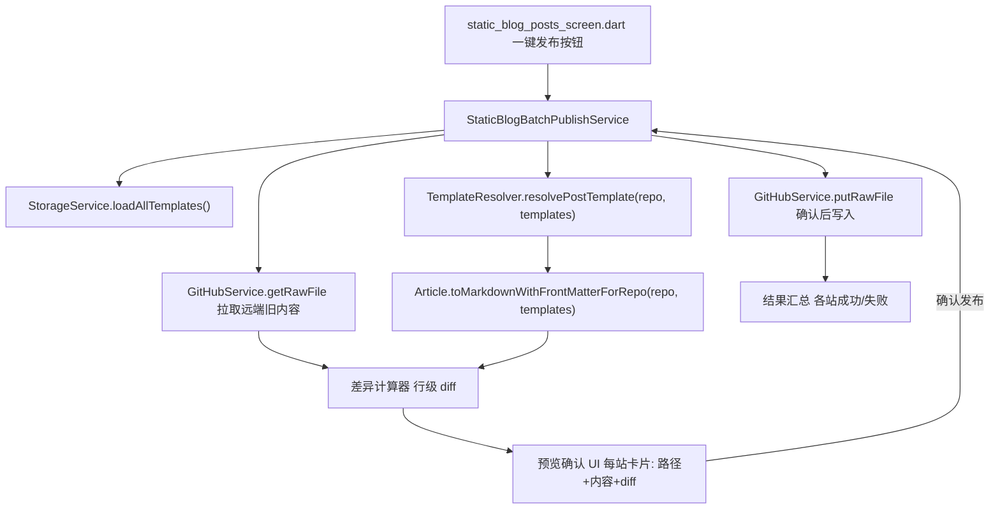

# 一键发布到多静态站（每站独立模板 + 发布前预览对比）

Feature Name: multi-site-one-click-publish
Updated: 2026-08-10

## Description

增强现有 `StaticBlogBatchPublishService`（lib/services/static_blog_batch_publish_service.dart），
使「一键发布同一篇文章到所有已登录静态站点」具备两个能力：

1. **每站独立默认模板渲染**：发布时按每个仓库的 `defaultPostTemplateId`（经
   `TemplateResolver.resolvePostTemplate` 解析）渲染 frontmatter 与正文，
   与单站发布 `upsertArticle` 链路输出一致，替代现有框架硬编码 `_toXxx` 转换。
2. **发布前预览与差异对比**：批量写入前进入只读预览阶段，逐站展示目标路径、
   将写入的文件完整内容，以及相对远程已存在文件的行级差异；用户确认后才执行写入。

「已登录」沿用现状定义：`RepoConfig.token` 非空且 GitHub `/user` 校验通过。

## Architecture



## Components and Interfaces

### 1. `StaticBlogBatchPublishService`（改造核心，lib/services/static_blog_batch_publish_service.dart）

- 构造器新增可选依赖 `StorageService`（或注入 `List<TemplateItem>` 模板源）。
- 新增公开方法 `Future<MultiSitePublishPreview> buildPreview(BlogPost post, {List<String>? selectedSiteIds})`：
  - 遍历目标仓库（`selectedSiteIds` 为空则全部静态仓库，按默认站点优先排序）；
  - 每站依次执行「解析模板 → 渲染内容 → 探测远端 → 生成 diff」；
  - 返回包含每站 `SitePublishPreview` 的预览对象，不产生任何写入。
- 新增公开方法 `Future<Map<String, dynamic>> publishFromPreview(BlogPost post, MultiSitePublishPreview preview)`：
  - 仅对预览中标记「待发布」且「用户已确认」的站点执行 `putRawFile`；
  - 复用既有批量循环、进度回调和失败隔离逻辑。
- 渲染统一走 `Article.toMarkdownWithFrontMatterForRepo`，删除框架硬编码 `_toXxx` 分支。

### 2. 渲染与模板解析

- 新增私有 `Article _toArticle(BlogPost post)`：把 BlogPost 字段映射为 Article
  （title/contentMd→content、date→createdAt、status→isDraft、slug、tags、categories）。
- 每站渲染前先 `TemplateResolver.resolvePostTemplate(repo, allTemplates)`：
  - 解析到模板 → 将模板 `id` 设为该 Article 的 `templateId`（单站链路同机制）；
  - 未解析到 → 沿用框架预设回退，输出与 `toMarkdownWithFrontMatterForRepo` 一致。
- 目标路径沿用既有 `postsPath + _fileNameFor` 计算，文件名规则保持现状。

### 3. 差异计算器

- 新增 `lib/core/diff/markdown_diff.dart`：`LineDiffResult diffText(String oldText, String newText)`。
- 采用 Myers 行级 diff，输出 `List<LineChange>`（type: added/removed/unchanged + 行号 + 文本）。
- 旧文本为空 → 返回「新建文件」标记。

### 4. 预览 UI（lib/screens/static_blog_posts_screen.dart）

- 「一键发布」点击后先请求 `buildPreview`，进入预览页/对话框：
  - 每站一个卡片：站点名、目标路径、文件命名、模板名、新建/更新标记；
  - 更新文件展示 diff（新增行高亮、删除行红显）；新建文件展示完整内容；
  - 未登录/token 无效站点展示「跳过」与原因；
  - 底部「确认发布」「取消」。
- 确认后调用 `publishFromPreview`，复用既有 `onProgress`/`onComplete`/结果对话框。

## Data Models

```dart
class SitePublishPreview {
  final RepoConfig repo;
  final String path;
  final String newContent;
  final String? oldContent;      // null=新建文件
  final String? templateName;    // 解析到的默认模板名
  final bool loggedIn;           // token 是否有效
  final String? loginError;
  final LineDiffResult? diff;    // oldContent 非空时存在
}

class MultiSitePublishPreview {
  final List<SitePublishPreview> sites;
  List<SitePublishPreview> get publishable => sites.where((s) => s.loggedIn).toList();
  int get newFileCount => sites.where((s) => s.oldContent == null).length;
  int get updateCount => sites.where((s) => s.oldContent != null).length;
}
```

## Correctness Properties

- 渲染输出 SHALL 与单站发布 `upsertArticle` 对同一 (repo, article) 完全一致（同一入口）。
- 预览阶段 SHALL NOT 产生任何 GitHub 写入请求。
- 仅 token 有效的仓库进入可发布集合；无效仓库 SHALL 在预览中显式跳过。
- 差异对比 SHALL 以远端 `ref=repo.branch` 内容为旧基线，避免与本地分支状态混淆。
- 单站失败 SHALL 不中断其余站点（沿用现有 try/catch 隔离）。

## Error Handling

| 场景 | 处理 |
|------|------|
| `loadAllTemplates` 失败 | 降级为框架预设渲染，预览中提示「模板加载失败，已用框架默认」 |
| 远端探测失败（网络/403） | 该站标记失败，原因入预览；其余站继续 |
| 确认发布时 token 已失效 | 该站失败，提示重新填写 token |
| 目标文件已被他人更新（sha 冲突） | GitHub 422 → 该站失败并提示「远程已被修改」，其余站继续 |
| 全部站点失败 | 汇总提示整体失败，不报告成功 |

## Test Strategy

- 单测（test/）：
  - `_toArticle` 字段映射完整性；
  - `TemplateResolver.resolvePostTemplate` 三档优先级（绑定>框架>回退）；
  - `diffText` 新增/删除/修改/空旧文本分支；
  - 同源输入下批量渲染输出 == `toMarkdownWithFrontMatterForRepo` 输出。
- 手动验证：
  - 两站不同框架（如 Hexo + Hugo）各绑定独立模板，一键发布后各站 frontmatter 符合该站模板；
  - 已存在目标文件时预览显示行级 diff，确认后才写入；
  - 未配置 token 站点在预览中被跳过并说明原因。

## References

[^1]: (lib/services/static_blog_batch_publish_service.dart) - 批量发布服务，`_convertForRepo`/`_toXxx` 为需替换的硬编码转换
[^2]: (lib/core/template_engine/template_resolver.dart#L9) - `resolvePostTemplate` 每站默认模板解析
[^3]: (lib/models/article.dart#L243) - `toMarkdownWithFrontMatterForRepo` 统一渲染入口
[^4]: (lib/services/github_service.dart#L223) - `upsertArticle` 单站发布（含 sha 探测与覆盖）
[^5]: (lib/screens/static_blog_posts_screen.dart#L645) - `batchPublishToStaticBlogs` 现有 UI 入口
