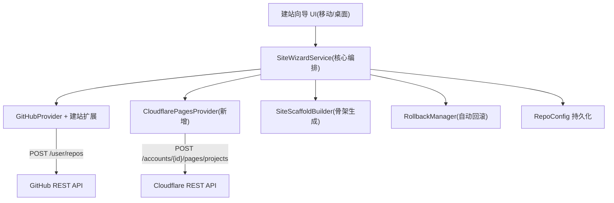

# 一键建站向导

Feature Name: one-click-site-wizard
Updated: 2026-08-14

## Description

拓墨 App 内从零搭建可访问的静态博客站点：多步向导，输入 GitHub Token 与 Cloudflare API Token，
完成「创建 GitHub 仓库 → 写入博客骨架 → 创建 Cloudflare Pages 项目 → 发布首篇文章 → 返回站点 URL」。
移动端与桌面端共用同一服务层；建站中途失败自动回滚清理半成品资源；站点默认私有（用户可改公开）。

对应需求文档：`.monkeycode/specs/one-click-site-wizard/requirements.md`

## Architecture



流程：向导 UI 仅负责收集输入与展示步骤；`SiteWizardService` 为唯一编排者，
按「建仓 → 骨架 → Pages 项目 → 首文 → 验证」顺序执行，任一步抛异常即触发 `RollbackManager` 逆序清理。

## Components and Interfaces

### 1. SiteWizardService（核心编排，新增 `lib/services/site_wizard_service.dart`）

```dart
class SiteWizardService {
  Future<WizardResult> run(WizardRequest req);
}
```

`WizardRequest`：`gitToken`、`cfApiToken`、`cfAccountId`、`repoName`、`repoPrivate`（默认 true）、`frameworkId`、`siteTitle`。
`WizardResult`：`repoConfig`（新站点 RepoConfig）、`pagesProjectName`、`siteUrl`、`welcomePostPath`。

执行序列：
1. 建仓：`GitHubProvider.createRepository(owner, name, private)`
2. 初始化分支：建仓后 `POST /repos/{owner}/{name}/git/refs` 创建 `refs/heads/main` 指向首个空 commit
3. 骨架：`SiteScaffoldBuilder.build(frameworkId, title)` 生成文件清单 → `GitHubProvider.writeBatch`
4. Pages：`CloudflarePagesProvider.createProject(...)` 并轮询首次构建
5. 首文：生成欢迎文章 → `writeBatch` → 触发 Pages 重建
6. 持久化：构造 `RepoConfig` 写入站点管理

### 2. GitHubProvider 扩展（`lib/services/git_providers.dart`）

- `Future<Map> createRepository(String token, String name, bool private)` → `POST https://api.github.com/user/repos`
- `Future<void> initDefaultBranch(String token, String owner, String name)` → 创建 `refs/heads/main`
- `Future<void> deleteRepository(String token, String owner, String name)` → `DELETE /repos/{owner}/{name}`（回滚用）

### 3. CloudflarePagesProvider（新增 `lib/services/cloudflare_pages_provider.dart`）

基于现有 `gitHttpRequest` 复用 HTTP 层，新增 Cloudflare 域名。

```dart
class CloudflarePagesProvider {
  Future<Map> verifyToken(String apiToken);          // GET /user/tokens/verify
  Future<Map> createProject(String apiToken, String accountId, CreatePagesProject req);
  Future<Map> getDeployment(String apiToken, String accountId, String project, String deploymentId);
  Future<void> deleteProject(String apiToken, String accountId, String project); // 回滚用
}
```

`CreatePagesProject`：`projectName`、`buildCommand`（框架映射）、`buildOutputDirectory`（框架映射）、
`productionBranch`（main）、`source`（GitHub 仓库连接，用于 CF 绑定 Git 源）。

### 4. SiteScaffoldBuilder（新增 `lib/services/site_scaffold_builder.dart`）

按 `BlogFramework.presets` 生成最小可构建骨架文件列表。以 Hexo 为例：

```
_config.yml        # 站点标题/时区/语言，对齐 BlogFramework postFrontMatter
package.json       # hexo + hexo-cli 依赖，scripts.build = "hexo generate"
scaffolds/post.md  # 默认文章模板
scaffolds/page.md  # 默认页面模板
scaffolds/draft.md # 草稿模板
themes/            # 默认主题配置占位
.gitignore
```

各框架输出目录/构建命令映射表（对齐 Cloudflare Pages 文档）：

| frameworkId | buildCommand | buildOutputDirectory |
|---|---|---|
| hexo | `npm run build` | `public` |
| hugo | `hugo --minify` | `public` |
| jekyll | `jekyll build` | `_site` |
| vuepress | `npm run docs:build` | `docs/.vuepress/dist` |
| gatsby | `gatsby build` | `public` |
| nextjs | `npm run build` | `out` |
| astro | `npm run build` | `dist` |
| pelican | `pelican content -o output -s publishconf.py` | `output` |
| 11ty | `npm run build` | `_site` |

### 5. RollbackManager（新增 `lib/services/rollback_manager.dart`）

```dart
class RollbackManager {
  Future<List<String>> rollback(RollbackPlan plan); // 返回未删除成功的资源描述
}
```

逆序执行：删除 CF Pages 项目 → 删除 GitHub 仓库。每步 try-catch，失败项收集到结果列表，
由完成页展示并提供手动删除入口。

### 6. 向导 UI（移动端 `lib/screens/`，桌面端 `lib/desktop/`）

- 移动端：`site_wizard_screen.dart`，Stepper 实现五步（账号连接 → 站点信息 → 选择模板 → 确认 → 完成）
- 桌面端：复用同一 `SiteWizardService`，以对话框或独立 Tab 承载
- Token 输入用 `TextField(obscureText: true)`，仅存安全存储（`flutter_secure_storage` 或现有 token 存储机制）

## Data Models

### RepoConfig 扩展（`lib/models/repo_config.dart`）

新增字段：
- `pagesProjectName`：CF Pages 项目名（可为空，非 Pages 站点为空）
- `siteUrl`：站点访问 URL（首次构建成功后回填）

复用既有 `frameworkId`、`postsPath`、`token`、`branch`（建站固定 `main`）。

### WizardRequest / WizardResult（`lib/models/wizard_models.dart` 新增）

见 Components 接口定义。

## Correctness Properties

1. **原子性**：建站五步任一失败即触发回滚，最终状态为「仓库与 Pages 项目均不存在」或「全部成功」。
2. **幂等重试**：重试使用新唯一仓库名（`repoName` 加时间戳后缀或让用户改名），不与残留资源冲突。
3. **Token 不出端**：Token 仅保存在本机安全存储，不上传第三方，不入日志。
4. **分支一致性**：建仓后先建 `main` 分支再 `writeBatch`，保证 Git API 写文件不依赖本地 git。
5. **可见性默认**：新建仓库默认 `private`，用户显式选择才改为 `public`。

## Error Handling

| 错误场景 | 检测 | 处理 |
|---|---|---|
| Git Token 无效 | `GET /user` 401 | 账号连接步提示重新输入 |
| CF Token 无效 | `GET /user/tokens/verify` 非 200 | 提示重新输入；区分「token 无效」与「缺 Pages 权限」 |
| 仓库名冲突 | `POST /user/repos` 422 | 展示冲突原因，允许改名重试 |
| 骨架写入失败 | `writeBatch` 异常 | 触发回滚删除仓库 |
| Pages 项目创建失败 | `POST .../pages/projects` 非 2xx | 触发回滚删除仓库；若 CF 已创建成功则逆序删除 |
| 首次构建失败 | 轮询 deployment status = failure | 展示构建日志摘要，不删除站点（允许用户修复后重试发布） |
| 回滚删除失败 | DELETE 异常 | 收集失败项，完成页提供手动删除入口 |

## Test Strategy

1. **单元测试**：
   - `SiteScaffoldBuilder`：对 9 个框架生成骨架文件清单快照测试（关键文件存在性 + front matter 对齐）
   - `RollbackManager`：注入失败 provider，验证逆序执行与失败项收集
   - 框架构建命令/输出目录映射表完整性测试
2. **集成测试（可选，需真实凭据）**：
   - 用测试账号跑通建仓 → 骨架 → Pages → 首文全流程，验证返回 `siteUrl` 可访问
3. **回归测试**：确保既有 `publishArticleWithMirrors` 发布链路不受 `RepoConfig` 新增字段影响

## References

[^1]: (requirements.md) - [需求文档](requirements.md)
[^2]: (lib/services/git_providers.dart#L24-L48) - [GitHubProvider.getUser/request 复用 HTTP 层](lib/services/git_providers.dart)
[^3]: (lib/services/git_providers.dart#L186-L270) - [writeBatch 原子批量提交](lib/services/git_providers.dart)
[^4]: (lib/services/git_http.dart#L8-L45) - [gitHttpRequest 通用 JSON 请求](lib/services/git_http.dart)
[^5]: (lib/models/blog_framework.dart) - [BlogFramework.presets 框架预设](lib/models/blog_framework.dart)
[^6]: (lib/models/repo_config.dart) - [RepoConfig 站点模型](lib/models/repo_config.dart)
