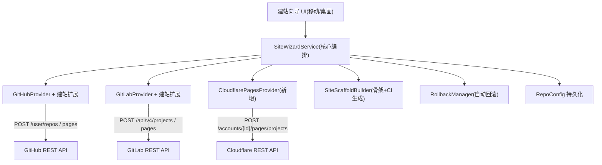

# 一键建站向导

Feature Name: one-click-site-wizard
Updated: 2026-08-14

## Description

拓墨 App 内从零搭建可访问的静态博客站点：多步向导，输入 Git 平台令牌（可选 Cloudflare API Token），
完成「创建 Git 仓库 → 写入博客骨架 → 创建站点项目 → 发布首篇文章 → 返回站点 URL」。
移动端与桌面端共用同一服务层；建站中途失败自动回滚清理半成品资源；站点默认私有（用户可改公开）。

支持两种建站模式：

- **模式一（零人工，纯令牌）**：GitHub Pages（GitHub Actions 构建）或 GitLab Pages（GitLab CI 构建），
  仅凭平台令牌全自动，返回 `https://{user}.github.io/{repo}/` 或 `https://{user}.gitlab.io/{project}/` 二级域名。
- **模式二（半自动，Cloudflare Pages）**：GitHub 建仓推骨架，用户在 Cloudflare 控制台网页完成一次
  「连接 Git 源」操作，App 检测项目后自动衔接发布。

对应需求文档：`.monkeycode/specs/one-click-site-wizard/requirements.md`

## Architecture



流程：向导 UI 仅负责收集输入与展示步骤；`SiteWizardService` 为唯一编排者。
模式一按「建仓 → 骨架+CI → 启用 Pages → 首文 → 验证」顺序执行；
模式二按「建仓 → 骨架 → 引导网页 → 检测衔接 → 首文 → 验证」顺序执行。
任一步抛异常即触发 `RollbackManager` 逆序清理（模式二用户已投入网页操作后不删仓库）。

## Components and Interfaces

### 1. SiteWizardService（核心编排，新增 `lib/services/site_wizard_service.dart`）

```dart
class SiteWizardService {
  Future<WizardResult> run(WizardRequest req);
}
```

`WizardRequest`：`mode`（one/githubPages/gitlabPages 或 two）、`gitProvider`（github/gitlab）、`gitToken`、`cfApiToken`、`cfAccountId`（模式二）、`repoName`、`repoPrivate`（默认 true）、`frameworkId`、`siteTitle`。
`WizardResult`：`repoConfig`（新站点 RepoConfig）、`siteProjectName`、`siteUrl`、`welcomePostPath`。

执行序列：

- 模式一（GitHub Pages）：建仓 → 建 main 分支 → 骨架+CI → 启用 Pages(Actions) → 首文 → 轮询 Actions → 验证
- 模式一（GitLab Pages）：建项目 → 骨架+CI（`.gitlab-ci.yml`）→ 启用 Pages → 首文 → 轮询 Pipeline → 验证
- 模式二（Cloudflare）：建仓 → 骨架（无 CI）→ 引导网页 → 检测衔接（自动拉 Deploy Hook）→ 首文 → 触发 Hook → 验证

### 2. GitProvider 建站扩展（`lib/services/git_providers.dart`）

GitHubProvider 新增：
- `Future<Map> createRepository(String token, String name, bool private)` → `POST https://api.github.com/user/repos`
- `Future<void> initDefaultBranch(String token, String owner, String name)` → 创建 `refs/heads/main`
- `Future<void> enablePages(String token, String owner, String name)` → `POST /repos/{owner}/{name}/pages`（source=GitHub Actions）
- `Future<Map> getActionsRun(String token, String owner, String name)` → 查询最近 workflow run 状态
- `Future<void> deleteRepository(String token, String owner, String name)` → `DELETE /repos/{owner}/{name}`（回滚用）

GitLabProvider 新增：
- `Future<Map> createProject(String token, String name, bool private)` → `POST https://gitlab.com/api/v4/projects`
- `Future<void> initDefaultBranch(String token, String projectId)` → 创建 `refs/heads/main`
- `Future<void> enablePages(String token, String projectId)` → `PUT /api/v4/projects/{id}/pages`
- `Future<Map> getPipeline(String token, String projectId)` → 查询最近 pipeline 状态
- `Future<void> deleteProject(String token, String projectId)` → `DELETE /api/v4/projects/{id}`（回滚用）

### 3. CloudflarePagesProvider（新增 `lib/services/cloudflare_pages_provider.dart`）

基于现有 `gitHttpRequest` 复用 HTTP 层，新增 Cloudflare 域名。

```dart
class CloudflarePagesProvider {
  Future<Map> verifyToken(String apiToken);          // GET /user/tokens/verify
  Future<List<Map>> listProjects(String apiToken, String accountId); // 检测用户新建项目
  Future<Map> getProject(String apiToken, String accountId, String project);
  Future<Map> getDeployment(String apiToken, String accountId, String project, String deploymentId);
  Future<void> deleteProject(String apiToken, String accountId, String project); // 回滚用
}
```

模式二衔接逻辑：`listProjects` 轮询到目标仓库名对应的新项目后，从项目详情读取 `deploy_hooks`
数组，自动取得 Deploy Hook URL 写入 `RepoConfig.deployHooks`，无需用户手动复制。

### 4. SiteScaffoldBuilder（新增 `lib/services/site_scaffold_builder.dart`）

按 `BlogFramework.presets` 生成最小可构建骨架文件列表。以 Hexo 为例：

```
_config.yml        # 站点标题/时区/语言，对齐 BlogFramework postFrontMatter
package.json       # hexo + hexo-cli 依赖，scripts.build = "hexo generate"
scaffolds/post.md  # 默认文章模板
scaffolds/page.md  # 默认页面模板
scaffolds/draft.md # 草稿模板
themes/            # 默认主题配置占位
.gitignore
```

模式一额外生成 CI 流水线文件（与平台对应）：

**GitHub Pages（`.github/workflows/deploy.yml`）**：
- trigger: `push` to `main`
- jobs: checkout → setup-node → `npm ci` → `npx hexo generate` → `actions/upload-pages-artifact`（path `public/`）→ `actions/deploy-pages`
- permissions: `contents: read`、`pages: write`、`id-token: write`

**GitLab Pages（`.gitlab-ci.yml`）**：
- `pages` job: image `node:18` → `npm ci` → `npx hexo generate` → artifacts path `public/`（expire 保留）→ 自动触发 Pages 部署
- 首页地址 `https://{user}.gitlab.io/{project}/`

各框架输出目录/构建命令映射表（对齐 Cloudflare Pages / 各平台 CI 文档）：

| frameworkId | buildCommand | buildOutputDirectory |
|---|---|---|
| hexo | `npm run build` | `public` |
| hugo | `hugo --minify` | `public` |
| jekyll | `jekyll build` | `_site` |
| vuepress | `npm run docs:build` | `docs/.vuepress/dist` |
| gatsby | `gatsby build` | `public` |
| nextjs | `npm run build` | `out` |
| astro | `npm run build` | `dist` |
| pelican | `pelican content -o output -s publishconf.py` | `output` |
| 11ty | `npm run build` | `_site` |

### 5. RollbackManager（新增 `lib/services/rollback_manager.dart`）

```dart
class RollbackManager {
  Future<List<String>> rollback(RollbackPlan plan); // 返回未删除成功的资源描述
}
```

逆序执行：站点项目（GitHub Pages 设置 / GitLab Pages / CF Pages 项目）→ Git 仓库。每步 try-catch，
失败项收集到结果列表，由完成页展示并提供手动删除入口。
模式二特例：用户已投入网页操作后失败，不执行仓库回滚，改为保留仓库并提供「手动继续」入口。

### 6. 向导 UI（移动端 `lib/screens/`，桌面端 `lib/desktop/`）

- 移动端：`site_wizard_screen.dart`，Stepper 实现分步（模式选择 → 账号连接 → 站点信息 → 选择模板 → 确认/执行 → 完成）
- 桌面端：复用同一 `SiteWizardService`，以对话框或独立 Tab 承载
- Token 输入用 `TextField(obscureText: true)`，仅存安全存储（`flutter_secure_storage` 或现有 token 存储机制）
- **模式二引导页**：逐步展示「在 Cloudflare 控制台连接 Git → 创建 Pages 项目」的对照文案
  （每步描述"你现在应该看到什么"），App 后台轮询检测项目，检测到后自动衔接
- **模式一进度页**：展示 Actions run / GitLab pipeline 的构建进度轮询

## Data Models

### RepoConfig 扩展（`lib/models/repo_config.dart`）

新增字段：
- `siteProjectName`：站点项目名（GitHub Pages 仓库名 / GitLab Pages 项目名 / CF Pages 项目名）
- `siteUrl`：站点访问 URL（首次构建成功后回填）
- `deployHooks`：模式二自动拉取的 Deploy Hook URL（模式一为空）

复用既有 `frameworkId`、`postsPath`、`token`、`provider`、`branch`（建站固定 `main`）。

### WizardRequest / WizardResult（`lib/models/wizard_models.dart` 新增）

见 Components 接口定义。

## Correctness Properties

1. **原子性**：建站各步骤任一失败即触发回滚，最终状态为「仓库与站点项目均不存在」或「全部成功」
   （模式二用户已投入网页操作后除外）。
2. **幂等重试**：重试使用新唯一仓库名（`repoName` 加时间戳后缀或让用户改名），不与残留资源冲突。
3. **Token 不出端**：Token 仅保存在本机安全存储，不上传第三方，不入日志。
4. **分支一致性**：建仓后先建 `main` 分支再 `writeBatch`，保证 Git API 写文件不依赖本地 git。
5. **可见性默认**：新建仓库默认 `private`，用户显式选择才改为 `public`。
6. **CI 自部署**：模式一的 Pages 部署由仓库内 CI 流水线完成（Actions/GitLab CI），App 只推送源码，
   不依赖 App 端执行任何构建。

## Error Handling

| 错误场景 | 检测 | 处理 |
|---|---|---|
| Git Token 无效 | `GET /user` 401 | 账号连接步提示重新输入 |
| CF Token 无效 | `GET /user/tokens/verify` 非 200 | 提示重新输入；区分「token 无效」与「缺 Pages 权限」 |
| 仓库名冲突 | 建仓接口 422 | 展示冲突原因，允许改名重试 |
| 骨架/CI 写入失败 | `writeBatch` 异常 | 触发回滚删除仓库 |
| Pages 启用失败 | 启用接口非 2xx | 触发回滚删除仓库 |
| 模式二网页操作超时 | 轮询超时（60s） | 提示"未检测到项目，检查 GitHub 账号/仓库名"，继续等待或放弃 |
| 首次构建失败 | 轮询状态 = failure | 展示构建日志摘要，不删除站点（允许用户修复后重试发布） |
| 回滚删除失败 | DELETE 异常 | 收集失败项，完成页提供手动删除入口 |

## Test Strategy

1. **单元测试**：
   - `SiteScaffoldBuilder`：对 9 个框架生成骨架文件清单快照测试（关键文件存在性 + front matter 对齐）
   - CI 流水线模板快照测试（`.github/workflows/deploy.yml` / `.gitlab-ci.yml` 关键字段校验）
   - `RollbackManager`：注入失败 provider，验证逆序执行与失败项收集
   - 框架构建命令/输出目录映射表完整性测试
2. **集成测试（可选，需真实凭据）**：
   - 模式一 GitHub：测试账号跑通建仓 → 骨架+CI → 启用 Pages → 首文 → 验证 `https://{user}.github.io/{repo}/`
   - 模式二 CF：验证建仓 → 骨架 → 检测衔接 → Deploy Hook 自动写入
3. **回归测试**：确保既有 `publishArticleWithMirrors` 发布链路不受 `RepoConfig` 新增字段影响

## References

[^1]: (requirements.md) - [需求文档](requirements.md)
[^2]: (lib/services/git_providers.dart#L24-L48) - [GitHubProvider.getUser/request 复用 HTTP 层](lib/services/git_providers.dart)
[^3]: (lib/services/git_providers.dart#L186-L270) - [writeBatch 原子批量提交](lib/services/git_providers.dart)
[^4]: (lib/services/git_http.dart#L8-L45) - [gitHttpRequest 通用 JSON 请求](lib/services/git_http.dart)
[^5]: (lib/models/blog_framework.dart) - [BlogFramework.presets 框架预设](lib/models/blog_framework.dart)
[^6]: (lib/models/repo_config.dart) - [RepoConfig 站点模型](lib/models/repo_config.dart)
