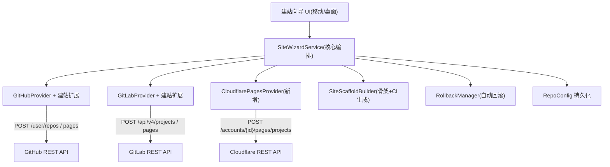

# 一键建站向导

Feature Name: one-click-site-wizard
Updated: 2026-08-14

## Description

拓墨 App 内从零搭建可访问的静态博客站点：多步向导，输入 Git 平台令牌（可选 Cloudflare API Token），
完成「创建 Git 仓库 → 写入博客骨架 → 创建站点项目 → 发布首篇文章 → 返回站点 URL」。
移动端与桌面端共用同一服务层；建站中途失败自动回滚清理半成品资源；站点默认私有（用户可改公开）。

支持两种建站模式：

- **模式一（零人工，纯令牌）**：GitHub Pages（GitHub Actions 构建）或 GitLab Pages（GitLab CI 构建），
  仅凭平台令牌全自动，返回 `https://{user}.github.io/{repo}/` 或 `https://{user}.gitlab.io/{project}/` 二级域名。
- **模式二（半自动，Cloudflare Pages）**：GitHub 建仓推骨架，用户在 Cloudflare 控制台网页完成一次
  「连接 Git 源」操作，App 检测项目后自动衔接发布。

对应需求文档：`.monkeycode/specs/one-click-site-wizard/requirements.md`

## Architecture



流程：向导 UI 仅负责收集输入与展示步骤；`SiteWizardService` 为唯一编排者。
模式一按「建仓 → 骨架+CI → 启用 Pages → 首文 → 验证」顺序执行；
模式二按「建仓 → 骨架 → 引导网页 → 检测衔接 → 首文 → 验证」顺序执行。
任一步抛异常即触发 `RollbackManager` 逆序清理（模式二用户已投入网页操作后不删仓库）。

## Components and Interfaces

### 1. SiteWizardService（核心编排，新增 `lib/services/site_wizard_service.dart`）

```dart
class SiteWizardService {
  Future<WizardResult> run(WizardRequest req);
}
```

`WizardRequest`：`mode`（one/githubPages/gitlabPages 或 two）、`gitProvider`（github/gitlab）、`gitToken`、`cfApiToken`、`cfAccountId`（模式二）、`repoName`、`repoPrivate`（默认 true）、`frameworkId`、`siteTitle`。
`WizardResult`：`repoConfig`（新站点 RepoConfig）、`siteProjectName`、`siteUrl`、`welcomePostPath`。

执行序列：

- 模式一（GitHub Pages）：建仓 → 建 main 分支 → 骨架+CI → 启用 Pages(Actions) → 首文 → 轮询 Actions → 验证
- 模式一（GitLab Pages）：建项目 → 骨架+CI（`.gitlab-ci.yml`）→ 启用 Pages → 首文 → 轮询 Pipeline → 验证
- 模式二（Cloudflare）：建仓 → 骨架（无 CI）→ 引导网页 → 检测衔接（自动拉 Deploy Hook）→ 首文 → 触发 Hook → 验证

### 2. GitProvider 建站扩展（`lib/services/git_providers.dart`）

GitHubProvider 新增：
- `Future<Map> createRepository(String token, String name, bool private)` → `POST https://api.github.com/user/repos`
- `Future<void> initDefaultBranch(String token, String owner, String name)` → 创建 `refs/heads/main`
- `Future<void> enablePages(String token, String owner, String name)` → `POST /repos/{owner}/{name}/pages`（source=GitHub Actions）
- `Future<Map> getActionsRun(String token, String owner, String name)` → 查询最近 workflow run 状态
- `Future<void> deleteRepository(String token, String owner, String name)` → `DELETE /repos/{owner}/{name}`（回滚用）
- `Future<Map> verifyScopes(String token)` → `GET /user` 响应头 `X-OAuth-Scopes`，校验 `repo` + `workflow`
- `Future<void> updateVisibility(String token, String owner, String name, bool private)` → `PATCH /repos/{owner}/{name}`（站点管理切换可见性）
- `Future<void> setCustomDomain(String token, String owner, String name, String cname)` → `PUT /repos/{owner}/{name}/pages` 设置 `cname` 字段

GitLabProvider 新增：
- `Future<Map> createProject(String token, String name, bool private)` → `POST https://gitlab.com/api/v4/projects`
- `Future<void> initDefaultBranch(String token, String projectId)` → 创建 `refs/heads/main`
- `Future<void> enablePages(String token, String projectId)` → `PUT /api/v4/projects/{id}/pages`
- `Future<Map> getPipeline(String token, String projectId)` → 查询最近 pipeline 状态
- `Future<void> deleteProject(String token, String projectId)` → `DELETE /api/v4/projects/{id}`（回滚用）
- `Future<Map> verifyScopes(String token)` → `GET /user` 响应中 `scopes` 字段，校验 `api`
- `Future<void> setCustomDomain(String token, String projectId, String cname)` → `PUT /api/v4/projects/{id}/pages` 设置自定义域

### 3. CloudflarePagesProvider（新增 `lib/services/cloudflare_pages_provider.dart`）

基于现有 `gitHttpRequest` 复用 HTTP 层，新增 Cloudflare 域名。

```dart
class CloudflarePagesProvider {
  Future<Map> verifyToken(String apiToken);          // GET /user/tokens/verify
  Future<List<Map>> listProjects(String apiToken, String accountId); // 检测用户新建项目
  Future<Map> getProject(String apiToken, String accountId, String project);
  Future<Map> getDeployment(String apiToken, String accountId, String project, String deploymentId);
  Future<void> deleteProject(String apiToken, String accountId, String project); // 回滚用
}
```

模式二衔接逻辑：`listProjects` 轮询到目标仓库名对应的新项目后，从项目详情读取 `deploy_hooks`
数组，自动取得 Deploy Hook URL 写入 `RepoConfig.deployHooks`，无需用户手动复制。

### 4. SiteScaffoldBuilder（新增 `lib/services/site_scaffold_builder.dart`）

按 `BlogFramework.presets` 生成最小可构建骨架文件列表。以 Hexo 为例：

```
_config.yml        # 站点标题/时区/语言，对齐 BlogFramework postFrontMatter
package.json       # hexo + hexo-cli 依赖，scripts.build = "hexo generate"
scaffolds/post.md  # 默认文章模板
scaffolds/page.md  # 默认页面模板
scaffolds/draft.md # 草稿模板
themes/            # 默认主题配置占位
.gitignore
```

模式一额外生成 CI 流水线文件（与平台对应）：

**GitHub Pages（`.github/workflows/deploy.yml`）**：
- trigger: `push` to `main`
- jobs: checkout → setup-node → `npm ci` → `npx hexo generate` → `actions/upload-pages-artifact`（path `public/`）→ `actions/deploy-pages`
- permissions: `contents: read`、`pages: write`、`id-token: write`

**GitLab Pages（`.gitlab-ci.yml`）**：
- `pages` job: image `node:18` → `npm ci` → `npx hexo generate` → artifacts path `public/`（expire 保留）→ 自动触发 Pages 部署
- 首页地址 `https://{user}.gitlab.io/{project}/`

各框架输出目录/构建命令映射表（对齐 Cloudflare Pages / 各平台 CI 文档）：

| frameworkId | buildCommand | buildOutputDirectory |
|---|---|---|
| hexo | `npm run build` | `public` |
| hugo | `hugo --minify` | `public` |
| jekyll | `jekyll build` | `_site` |
| vuepress | `npm run docs:build` | `docs/.vuepress/dist` |
| gatsby | `gatsby build` | `public` |
| nextjs | `npm run build` | `out` |
| astro | `npm run build` | `dist` |
| pelican | `pelican content -o output -s publishconf.py` | `output` |
| 11ty | `npm run build` | `_site` |

### 5. RollbackManager（新增 `lib/services/rollback_manager.dart`）

```dart
class RollbackManager {
  Future<List<String>> rollback(RollbackPlan plan); // 返回未删除成功的资源描述
}
```

逆序执行：站点项目（GitHub Pages 设置 / GitLab Pages / CF Pages 项目）→ Git 仓库。每步 try-catch，
失败项收集到结果列表，由完成页展示并提供手动删除入口。
模式二特例：用户已投入网页操作后失败，不执行仓库回滚，改为保留仓库并提供「手动继续」入口。

### 6. 向导 UI（移动端 `lib/screens/`，桌面端 `lib/desktop/`）

- 移动端：`site_wizard_screen.dart`，Stepper 实现分步（模式选择 → 账号连接 → 站点信息 → 选择模板 → 确认/执行 → 完成）
- 桌面端：复用同一 `SiteWizardService`，以对话框或独立 Tab 承载
- Token 输入用 `TextField(obscureText: true)`，仅存安全存储（`flutter_secure_storage` 或现有 token 存储机制）
- **模式二引导页**：逐步展示「在 Cloudflare 控制台连接 Git → 创建 Pages 项目」的对照文案
  （每步描述"你现在应该看到什么"），App 后台轮询检测项目，检测到后自动衔接
- **模式一进度页**：展示 Actions run / GitLab pipeline 的构建进度轮询
- **取消对话框**：向导过程中用户点击取消/返回主页，若已创建资源则弹出确认框：
  - 未投入网页操作 → 提示"将清理本次已创建的资源"并触发 `RollbackManager`（复用失败回滚路径）
  - 模式二已投入网页操作 → 提示"仓库将保留，可稍后在站点管理继续"，不触发回滚

### 6.1 账号连接补充（scope 预校验）

- 令牌有效校验后，进一步校验 scope：
  - GitHub：`GET /user` 响应头 `X-OAuth-Scopes` 需包含 `repo` + `workflow`，
    缺失时在账号连接步直接列出缺失项并引导重新生成令牌（早失败，避免建仓/启用 Pages 阶段才报错）
  - GitLab：`GET /user` 的 `scopes` 字段需包含 `api`
- 校验落点：`GitHubProvider.verifyScopes` / `GitLabProvider.verifyScopes`

### 6.2 首次构建轮询超时

- 首次构建轮询上限默认 **10 分钟**（可配置常量 `wizardBuildPollTimeout`）
- 超时处理：停止轮询，完成页展示"构建仍在进行"提示，站点仍写入站点管理
  （`siteUrl` 置空），后续构建完成后通过既有状态轮询/下次访问回填 `siteUrl`
- 进度页提供「放弃等待」按钮，点击后回到站点管理，不触发回滚

### 6.3 站点管理可见性切换（建站后）

- 站点管理新增「切换可见性」操作，调用 `GitHubProvider.updateVisibility`（`PATCH /repos/{owner}/{name}`）
- 免费账号从 `public` 切到 `private` 时，提示「GitHub 免费账号私有仓库无法启用 Pages，
  该操作可能导致站点停用」
- 仅模式一 GitHub 提供此入口；GitLab 与 Cloudflare 场景不提供（可见性由平台侧管理）

### 6.4 自定义域名绑定引导（完成页/站点管理入口）

- 完成页与站点管理新增「绑定自定义域名」入口，按平台走分步引导：
  - **GitHub**：Step 1 提示在 DNS 服务商添加 CNAME `{repo}.{user}.github.io` →
    Step 2 App 调用 `GitHubProvider.setCustomDomain`（`PUT /repos/{owner}/{repo}/pages` 设 `cname`）→
    Step 3 提示等待 HTTPS 生效并展示验证状态
  - **GitLab**：Step 1 提示在 DNS 服务商添加记录 → Step 2 引导在 GitLab Pages 设置填写域名 →
    Step 3 提示验证 DNS 生效
  - **Cloudflare**：引导在 CF 控制台 Pages 项目「自定义域」中添加域名，走 CF 自有 DNS 绑定流程
    （CF 账号可自动完成 DNS 配置，App 仅跳转引导）
- 每步展示「现在你应该看到什么 / 下一步做什么」对照文案，并标注需前往的控制台
- 域名绑定成功后更新 `RepoConfig.siteUrl` 为自定义域名
- 对应需求：Requirement 10（自定义域名绑定引导）

### 7. 建站结果自动接入（登录令牌 + 多仓库 + 一键发布）

建站成功后的最终产物不是"一个 URL"，而是让新站点立即进入现有的完整发布链路。
`SiteWizardService` 在持久化阶段执行以下三步接入：

#### 7.1 注册登录令牌（复用 `lib/mixins/settings_dialogs_ext.dart` 令牌管理）

- 建站使用的 Git Token（GitHub PAT / GitLab PAT）若未存在于已登录令牌列表
  （`settings.activeGithubTokenId` / `GitHubTokenProfile` 列表），System SHALL 自动创建对应 `GitHubTokenProfile`
  并存入令牌管理，供后续复用。
- 模式二额外将 Cloudflare API Token 保存到 `AppSettings` 新增字段 `cfApiToken` / `cfAccountId`
  （复用 `flutter_secure_storage`，与既有 token 相同存储策略），供后续页面展示"已连接 Cloudflare"。
- 完成后令牌管理列表自动出现新条目，无需用户重复输入。

#### 7.2 注册静态站点（复用 `RepoConfig` 站点管理）

- 构造 `RepoConfig`：
  - `provider`：github / gitlab
  - `frameworkId`：向导所选框架
  - `postsPath`：按 `BlogFramework` 预设（默认 `source/_posts`）
  - `branch`：`main`
  - `token`：建站令牌
  - `defaultPostTemplateId`：调用 `RepoConfig.defaultPostTemplateForFramework` 绑定框架内置模板，
    保证后续发布直接应用发布模板（对齐 `TemplateResolver.resolvePostTemplate` 的优先级链）
  - 新增 `siteProjectName` / `siteUrl` / `deployHooks`（见 Data Models）
- 调用既有站点持久化入口（`main.dart`/`desktop_shell.dart` 中加载仓库列表的同一存储），
  新站点立即出现在「站点管理」列表与 `_publishToAllStaticSites` 的候选集中。

#### 7.3 一键发布（复用 `editor_publish_ext.dart` 既有链路）

- 建站完成后，新站点即被 `publishArticleWithMirrors` / `_publishToAllStaticSites` 识别，
  在写文章界面的发布对话框（`editor_publish_ext.dart`）中：
  - 单站点：当前站点为新站时走 `upsertArticle(repo, article, templates: templates)`，
    模板经 `TemplateResolver.resolvePostTemplate` 解析（仓库绑定 > 框架内置 > 首个可用）
  - 多站点：勾选「同时发布到所有静态博客站点」即可一键发布到全部已登录站点（含新站）
- 发布完成后触发部署：
  - 模式一（GitHub Pages / GitLab Pages）：推送即触发 CI 流水线自动构建，无需额外动作
  - 模式二（Cloudflare）：走既有 `triggerCloudflareDeploy`（github_service.dart:720）触发 Deploy Hook 重建

### 8. AI 令牌与工具系统联动（`lib/core/tools/` / `lib/core/ai/`）

建站向导遵循「AI 令牌 + 工具系统」的既有交互模式（对齐 `AiToolManager` / `ToolExecutor` 的工具注册与调用机制）：

- **AI 建站工具**：新增内置工具 `create_site`（注册到 `builtin_tools.dart`），
  AI 会话中用户说出"帮我建一个博客站"时，工具携带建站参数调用 `SiteWizardService.run`，
  结果回传为 AI 可读的建站报告（仓库地址 / 站点 URL / 后续操作建议）。
- **AI 模型前置校验**：执行 `create_site` 前 SHALL 校验 AI 模型是否已配置
  （`effectiveAiApiKey` 非空且存在有效 `activeAiProfile`）。未配置时工具不执行，
  返回"请先在 AI 设置中配置模型"并引导跳转 `AiSettingsScreen`；用户完成配置后重试。
  - 校验落点：`AiSettings.effectiveAiApiKey`（models/ai_settings.dart:53）为空
    或 `activeAiProfile == null`（models/ai_settings.dart:40）即判定未配置。
- **AI 发布工具**：复用既有发布工具链路，建站成功后文章发布对话框可直接由 AI 触发，
  参数含目标站点（新站）与发布模板。
- **权限确认**：对齐 `aiConfirmHighRiskTools` 策略——建仓 / 删除回滚为高风险操作，
  默认需用户确认；仅当用户在 AI 设置中开启全权模式才自动执行。
- **AI 令牌来源**：建站与发布均使用用户已配置的 AI 令牌（`activeAiProfile`），
  与「我的工具/工具库」中的自定义工具共存，不引入新的令牌体系。
- **全局提示词建议（用户侧维护，非代码）**：AI 设置中的全局提示词可加入一句
  「建站相关需求请使用 `create_site` 工具；AI 设置未配置模型时先引导用户配置」，
  用于提高 AI 识别建站意图并正确调用工具的触发率。该提示词由用户在其 AI 设置中自行维护，
  工具描述（`builtin_tools.dart`）才是 AI 感知建站能力的正式来源，两者不冲突。

## Data Models

### RepoConfig 扩展（`lib/models/repo_config.dart`）

新增字段：
- `siteProjectName`：站点项目名（GitHub Pages 仓库名 / GitLab Pages 项目名 / CF Pages 项目名）
- `siteUrl`：站点访问 URL（首次构建成功后回填）
- `deployHooks`：模式二自动拉取的 Deploy Hook URL（模式一为空）

复用既有 `frameworkId`、`postsPath`、`token`、`provider`、`branch`（建站固定 `main`）、
`defaultPostTemplateId`（建站时绑定框架内置模板，接入发布模板解析链）。

### AppSettings 扩展（`lib/models/app_settings.dart`）

新增字段：
- `cfApiToken`：Cloudflare API Token（模式二建站后保存，模式一为空）
- `cfAccountId`：Cloudflare 账号 ID（模式二建站后保存）
- `deployHooks`：既有字段，模式二建站时自动追加 Deploy Hook URL

### GitHubTokenProfile 自动注册（`lib/models/github_token_profile.dart`）

建站令牌自动生成 `GitHubTokenProfile`（provider、displayLabel、token），
存入令牌管理列表；若 provider+token 已存在则跳过，避免重复。

### WizardRequest / WizardResult（`lib/models/wizard_models.dart` 新增）

见 Components 接口定义。

## Correctness Properties

1. **原子性**：建站各步骤任一失败即触发回滚，最终状态为「仓库与站点项目均不存在」或「全部成功」
   （模式二用户已投入网页操作后除外）。
2. **幂等重试**：重试使用新唯一仓库名（`repoName` 加时间戳后缀或让用户改名），不与残留资源冲突。
3. **Token 不出端**：Token 仅保存在本机安全存储，不上传第三方，不入日志。
4. **分支一致性**：建仓后先建 `main` 分支再 `writeBatch`，保证 Git API 写文件不依赖本地 git。
5. **可见性默认**：新建仓库默认 `private`，用户显式选择才改为 `public`。
6. **CI 自部署**：模式一的 Pages 部署由仓库内 CI 流水线完成（Actions/GitLab CI），App 只推送源码，
   不依赖 App 端执行任何构建。
7. **接入幂等**：令牌注册 / 站点注册 / Deploy Hook 追加均为"存在则跳过"，重复建站不会产生重复条目。
8. **发布零配置**：新站建立后无需任何额外配置即可被既有发布链路识别并一键发布。
9. **取消即清理**：用户主动取消且未投入网页操作时，与失败走同一回滚路径，不留半成品。
10. **scope 早失败**：令牌 scope 不足在账号连接步即拦截，避免建仓/启用 Pages 阶段才失败。
11. **构建等待有界**：首次构建轮询设 10 分钟上限，超时停止轮询但不回滚、不丢站点记录。
12. **Pages 免费限制可见**：GitHub 免费账号私有仓库不能启用 Pages 的限制在建站前提示、
    建站后切换可见性时再次提示。

## Error Handling

| 错误场景 | 检测 | 处理 |
|---|---|---|
| Git Token 无效 | `GET /user` 401 | 账号连接步提示重新输入 |
| Git Token scope 不足 | `verifyScopes` 缺失 `repo`+`workflow`（GitHub）或 `api`（GitLab） | 账号连接步列出缺失项，引导重新生成令牌 |
| CF Token 无效 | `GET /user/tokens/verify` 非 200 | 提示重新输入；区分「token 无效」与「缺 Pages 权限」 |
| 仓库名冲突 | 建仓接口 422 | 展示冲突原因，允许改名重试 |
| 骨架/CI 写入失败 | `writeBatch` 异常 | 触发回滚删除仓库 |
| Pages 启用失败（私有仓库） | 启用接口非 2xx，且仓库为 private | 归因到可见性，提示免费账号需改公开后重试 |
| 用户主动取消 | 取消对话框确认 | 未投入网页操作 → 触发回滚；模式二已投入 → 保留仓库提示手动继续 |
| 模式二网页操作超时 | 轮询超时（60s） | 提示"未检测到项目，检查 GitHub 账号/仓库名"，继续等待或放弃 |
| 首次构建失败 | 轮询状态 = failure | 展示构建日志摘要，不删除站点（允许用户修复后重试发布） |
| 首次构建超时 | 轮询达 10 分钟上限 | 停止轮询，站点仍入库（`siteUrl` 待回填），不触发回滚 |
| 域名绑定失败 | 设置 cname / 添加自定义域接口非 2xx | 提示检查 DNS 记录是否已生效并允许重试 |
| 回滚删除失败 | DELETE 异常 | 收集失败项，完成页提供手动删除入口 |

## Test Strategy

1. **单元测试**：
   - `SiteScaffoldBuilder`：对 9 个框架生成骨架文件清单快照测试（关键文件存在性 + front matter 对齐）
   - CI 流水线模板快照测试（`.github/workflows/deploy.yml` / `.gitlab-ci.yml` 关键字段校验）
   - `RollbackManager`：注入失败 provider，验证逆序执行、失败项收集、取消复用同一路径
   - 框架构建命令/输出目录映射表完整性测试
   - `verifyScopes`：注入不同 `X-OAuth-Scopes` 响应头，验证缺失 scope 判定
   - 构建轮询超时：注入固定 pending 状态，验证 10 分钟上限后停止并保留站点记录
2. **集成测试（可选，需真实凭据）**：
   - 模式一 GitHub：测试账号跑通建仓 → 骨架+CI → 启用 Pages → 首文 → 验证 `https://{user}.github.io/{repo}/`
   - 模式一 GitHub 可见性限制：私有仓库启用 Pages 失败 → 归因到可见性 → 改公开后成功
   - 模式二 CF：验证建仓 → 骨架 → 检测衔接 → Deploy Hook 自动写入
3. **回归测试**：确保既有 `publishArticleWithMirrors` 发布链路不受 `RepoConfig` 新增字段影响

## References

[^1]: (requirements.md) - [需求文档](requirements.md)
[^2]: (lib/services/git_providers.dart#L24-L48) - [GitHubProvider.getUser/request 复用 HTTP 层](lib/services/git_providers.dart)
[^3]: (lib/services/git_providers.dart#L186-L270) - [writeBatch 原子批量提交](lib/services/git_providers.dart)
[^4]: (lib/services/git_http.dart#L8-L45) - [gitHttpRequest 通用 JSON 请求](lib/services/git_http.dart)
[^5]: (lib/models/blog_framework.dart) - [BlogFramework.presets 框架预设](lib/models/blog_framework.dart)
[^6]: (lib/models/repo_config.dart) - [RepoConfig 站点模型](lib/models/repo_config.dart)
