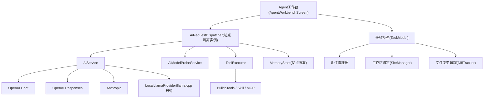

# Operit 级 Agent 工作台与思考模式

Feature Name: operit-agent-workbench
Updated: 2026-08-09

## Confirmed Decisions（2026-08-09）

1. **本地模型仅 Android FFI（llama.cpp GGUF）**：Android 上通过 FFI 直接加载 libllama.so 跑 GGUF，写文章完全离线；非 Android 平台本地模型不可用并给出提示。不做 Ollama 兜底通道（Android 端 Ollama 服务端部署不现实）。
2. **第一批优先交付 Agent 工作台 + 思考模式**：真实思考模式（reasoning 透传 + 渲染）与面向任务的 Agent 工作台先行。
3. **模型配置全局共享**：`ai_models.json` 保持全局；对话历史、长期记忆、工具作用域按站点隔离。
4. **多站点隔离**：对话历史文件扩展为 `ai_chat_{siteId}_{sessionType}.json`；dispatcher 按站点持有上下文实例。
5. **Agent 工作台 UI：独立工作台页，复用现有 AiChatPanel 对话能力**：新增 Agent 工作台页面作为入口，在其外层加任务头（附件/工作区/文件变更/任务状态），对话区复用 AiChatPanel。
6. **长期记忆与角色体系：全量实现**：角色卡（绑定模型/记忆空间/工具包/Skill/MCP、Tavern JSON/PNG 兼容、导入导出备份）+ 多角色群聊 UI（@ 交互、角色间协作）一次性实现。

## Description

将 Hexo 博客 App 的 AI 会话从「单轮问答」升级为 Operit 级别的 Agent 任务工作台：

1. **思考模式真实生效**：`AiModelEntity.thinkingEnabled` 从预留字段变为驱动请求体参数的开关；`ToolCallResponse` 携带 `reasoningContent`，对话界面独立渲染推理过程。
2. **Agent 任务工作台**：任务绑定（附件 + 工作区 + 目标）、工具执行时间线、文件变更追踪与 Diff 预览、多轮续跑、断点恢复。
3. **多站点隔离修复**：对话历史按站点分区、dispatcher 上下文实例按站点持有。
4. **本地模型通道**：llama.cpp GGUF 通过 Android FFI 加载，作为新 Provider 纳入现有模型路由。
5. **密钥池与模型路由**：同提供商多 Key 轮转、按任务类型路由、连接测试。

## Architecture



架构说明：

- **AiRequestDispatcher 改造为按站点实例化**：由全局单例改为 `SiteDispatcherManager` 按 `siteId` 维护实例池，切换站点获取对应实例，消除串场。
- **思考模式贯穿请求层**：`AiService` 三协议增加 reasoning 参数注入与 `reasoning_content` 解析，`ToolCallResponse` 增加 `reasoningContent` 字段。
- **本地模型走统一 Provider 抽象**：`LocalLlamaProvider` 实现与云模型相同的 `completeWithTools` 接口，纳入 `AiModelManager` 的 provider 枚举与路由。
- **工作台是会话的编排层**：`TaskModel` 持有多轮消息、附件引用、工具执行记录、文件变更清单，序列化到 `task_{siteId}_{taskId}.json`。

## Components and Interfaces

### 1. 思考模式（Thinking Mode）

#### 请求体注入（lib/services/ai_service.dart）

| 协议 | 参数 | 注入位置 |
|------|------|---------|
| openai_chat | `reasoning_effort: low/medium/high`（或 deepseek `thinking` 开关） | `_completeWithToolsOpenAIChat` body（第 836 行附近） |
| openai_responses | `reasoning: {effort: ...}` | `_completeWithToolsOpenAIResponses` |
| anthropic | `thinking: {type: "enabled", budget_tokens: N}` | `_completeWithToolsAnthropic` |
| llama.cpp | `"thinking"` 状态透传 | `LocalLlamaProvider` |

`thinkingEnabled` 由 `AiModelEntity` 携带，dispatcher 构造请求时读取并传入 AiService。

#### 响应解析（reasoning_content）

- openai_chat：`message.reasoning_content`（DeepSeek R1 风格）或 `message.reasoning`
- anthropic：`content[]` 中 `type=="thinking"` 块
- 统一写入 `ToolCallResponse.reasoningContent`（新增字段，`String?`）
- 非工具轮次返回时，`allMessages` 中保留 assistant 原始 message（含 reasoning），历史回填不丢失

#### UI 渲染

- `AiChatPanel` 消息气泡上方增加可折叠「思考过程」区块，`StreamChunk` 流式渲染推理文本（灰色/斜体，与正文区分）
- 思考模式开启时请求中已渲染；关闭时不展示

### 2. Agent 工作台

新增 `lib/screens/agent_workbench_screen.dart` + `lib/core/task/task_model.dart` + `lib/core/task/task_repository.dart`。

```dart
class AgentTask {
  final String id;
  final String siteId;
  final String title;
  final String objective;          // 任务目标
  final List<String> attachmentPaths; // 附件（工作区相对路径）
  final String? workspacePath;     // 绑定的工作区/仓库路径
  final List<Map<String, dynamic>> messages; // 多轮对话（含工具记录）
  final List<ToolExecRecord> toolRecords;    // 工具执行时间线
  final List<FileChange> fileChanges;        // 文件变更追踪
  final DateTime createdAt;
  final DateTime updatedAt;
  final String status;             // running / paused / done / failed
}
```

- **附件**：复用 `file_picker`，附件复制到站点工作区 `sites/{siteId}/tasks/{taskId}/attachments/`
- **工作区绑定**：通过 `SiteManager` 获取当前仓库根路径，注入系统提示词与工具工作目录
- **工具执行时间线**：`ToolExecRecord { toolName, argsSummary, resultSummary, durationMs, status }`，UI 以时间线渲染
- **文件变更追踪**：`FileChange { path, op(add/modify/delete), diffPreview }`，工具执行前后对比（复用 `conflict_diff_service.dart` 的 diff 能力）
- **断点恢复**：`TaskRepository` 序列化任务到 `task_{siteId}_{taskId}.json`，重启后可从暂停点恢复，恢复时重放 messages 与已完成的工具结果
- **任务总结**：任务结束时调用 AI 生成总结（产出物清单、变更统计、耗时）

工作台复用现有 `AiChatPanel` 的对话能力，在其外层增加任务信息头（附件列表、工作区标识、文件变更按钮、任务状态）。

### 3. 多站点隔离

新增 `lib/core/ai/site_dispatcher_manager.dart`：

```dart
class SiteDispatcherManager {
  final Map<String, AiRequestDispatcher> _instances = {};
  AiRequestDispatcher forSite(String siteId) =>
      _instances.putIfAbsent(siteId, () => AiRequestDispatcher());
  void disposeSite(String siteId) => _instances.remove(siteId);
}
```

- 替换 `desktop_shell.dart` 与 `main.dart` 中的全局单例引用
- 对话历史持久化键：`ai_chat_{siteId}_{sessionType.name}.json`（无 siteId 的旧文件兼容迁移：若存在旧文件，读入后首次保存时写入新站点文件）
- `McpRuntime.siteId`、`BuiltinTools.siteCredentials` 保持按站点注入，`ToolScope.sitePrivate` 过滤逻辑不变

### 4. 本地模型（llama.cpp GGUF）

新增 `lib/core/ai/local_llama_provider.dart`：

```dart
class LocalLlamaProvider {
  // Android FFI 入口（通过 dart:ffi 加载 libllama.so）
  Future<String> generate({
    required String modelPath,     // GGUF 文件路径
    required List<Map<String, dynamic>> messages,
    double temperature = 0.7,
    int maxTokens = 2048,
    bool thinking = false,
    void Function(String)? onChunk, // 流式回调
  });
}
```

- **模型文件管理**：`lib/services/gguf_model_service.dart` —— 扫描下载目录/应用私有目录中的 `.gguf` 文件，登记到 `local_models.json`（名称、路径、参数量、量化类型、上下文大小）
- **Android 集成**：`android/app/src/main/jniLibs/` 放置 `libllama.so` + `llama.h`；FFI 加载；**仅 Android 可用**，iOS/桌面平台检测到本地模型时提示「本地模型仅在 Android 可用」
- **接入模型路由**：`AiProvider` 增加 `local` 枚举；`AiModelEntity` 以 `apiBase=local://`、`apiKey=空`、`modelId=gguf文件名` 形式入列表；`AiService` 检测到 local provider 时走 `LocalLlamaProvider`；不做 Ollama 兜底通道
- 写文章场景：1.5B-7B Q4_K_M 量化 GGUF 即可离线生成，纳入 `general` 任务组

### 5. 密钥池与模型路由增强

- `AiModelEntity` 增加 `List<String> keyPool`（同提供商多 Key）；`AiModelManager` 增加轮转分配与失败剔除（连续 3 次失败暂移出池）
- 按任务类型路由：`AiRequestDispatcher` 从 `AiModelProbeService.getPriorityQueue` 按 `group` 过滤（code/general/longtext），路由逻辑已在 `getEnabled` 支持 group 过滤，增强为「优先本组模型，组内按延迟排序」
- 连接测试：复用 `AiModelManager` 的 ping 逻辑，结果展示连通性/延迟/协议兼容

## Data Models

### AiModelEntity 扩展（lib/core/ai/ai_model_entity.dart）

```dart
// 已有字段
final bool thinkingEnabled;      // 现在真正驱动请求参数
final InterfaceType interfaceType;

// 新增字段
final List<String> keyPool;      // 密钥池
final bool isLocalModel;         // 本地 GGUF 模型
final String? localModelPath;    // GGUF 文件路径
```

### ToolCallResponse 扩展（lib/services/ai_service.dart）

```dart
final String? reasoningContent;  // 推理过程文本（新增）
```

### AgentTask（新增 lib/core/task/task_model.dart）

```dart
class ToolExecRecord {
  final String toolName;
  final String argsSummary;
  final String resultSummary;
  final int durationMs;
  final String status;   // success / failed
}

class FileChange {
  final String path;
  final String op;       // add / modify / delete
  final String diffPreview;
}
```

### 持久化文件

| 文件 | 位置 | 说明 |
|------|------|------|
| `ai_chat_{siteId}_{sessionType}.json` | StorageService root | 按站点分区的对话历史 |
| `task_{siteId}_{taskId}.json` | StorageService root | Agent 任务状态（断点恢复） |
| `local_models.json` | StorageService root | 本地 GGUF 模型登记 |
| `ai_models.json` | StorageService root | 保持全局共享（含 keyPool 字段） |

## Correctness Properties

1. 思考模式开启时，请求体 SHALL 携带对应协议的推理参数；关闭时 SHALL NOT 携带。
2. `reasoning_content` SHALL 独立于正文渲染，正文 SHALL NOT 混入推理文本。
3. 站点 A/B 的对话历史 SHALL 分别存储，切换站点 SHALL 加载对应历史，SHALL NOT 混入。
4. 同一站点内新建会话 SHALL 复用该站点 dispatcher 实例上下文。
5. 本地模型请求 SHALL 走 `LocalLlamaProvider`，SHALL 不发送网络请求。
6. 密钥池 Key 连续失败 3 次 SHALL 暂移出轮转；轮空时 SHALL 回退首 Key。
7. 任务断点恢复 SHALL 重放已完成工具结果，SHALL NOT 重复执行已完成工具。
8. 模型配置（ai_models.json）跨站点共享 SHALL 保持不变。

## Error Handling

| 场景 | 处理 |
|------|------|
| 模型不支持思考模式 | 界面隐藏/禁用思考开关，提示不支持 |
| 思考请求超时 | 走现有超时降级切换逻辑 |
| 本地 GGUF 模型文件缺失/损坏 | 返回「模型文件不可用」，引导重新导入 |
| 本地模型在非 Android 平台 | 提示「本地模型仅在 Android 可用」 |
| 任务中断 | 保存 paused 状态，支持从断点恢复 |
| 密钥池 Key 全部失效 | 回退首 Key 并提示检查密钥 |
| 旧版无站点对话历史 | 迁移：读入旧文件，首次保存写入站点文件 |

## Test Strategy

1. **思考模式**：mock OpenAI/DeepSeek 响应含 `reasoning_content`，验证解析与独立渲染；请求体含 `reasoning_effort`。
2. **多站点隔离**：站点 A 发消息后切站点 B，验证 B 不显示 A 的历史，持久化到不同文件。
3. **Agent 任务**：mock 工具执行，验证时间线记录、文件变更追踪、断点恢复重放。
4. **本地模型**：mock FFI 层，验证 generate 参数透传与流式回调。
5. **密钥池**：mock 失败响应，验证轮转与剔除。
6. 验证命令：`flutter test`。

## References

[^1]: lib/core/ai/ai_request_dispatcher.dart - 现有全局单例调度器（_chatHistory、dispatchStream、故障切换）
[^2]: lib/core/ai/ai_model_entity.dart - thinkingEnabled 预留字段、interfaceType
[^3]: lib/services/ai_service.dart - 三协议 completeWithTools（第 819/722/643 行注入点）
[^4]: lib/services/ai_service.dart#L1049 - ToolCallResponse 定义
[^5]: lib/core/ai/ai_model_manager.dart - 模型 CRUD、getEnabled group 过滤、ping
[^6]: lib/widgets/ai_chat_panel.dart - 可复用 AI 对话面板（工作台基底）
[^7]: lib/services/conflict_diff_service.dart - diff 能力（文件变更预览复用）
[^8]: lib/core/site_manager.dart - 站点身份与工作区
[^9]: lib/core/tools/mcp_runtime.dart - 站点私有工具过滤
[^10]: lib/services/site_isolation_service.dart - 站点数据加密存储
