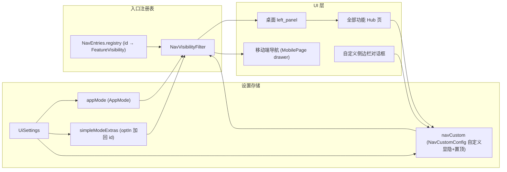

# 侧边栏枢纽页与可视化自定义（Sidebar Hub and Customization）

Feature Name: sidebar-hub-and-customization
Updated: 2026-08-17

## Description

解决桌面侧边栏入口过多、重复、低频占用导航空间的问题，提供三个层次的能力：入口去重瘦身、全部功能枢纽页（Hub）收纳低频入口、可视化自定义显隐与置顶。同时将自定义配置共享到移动端导航，实现双端一致。

## Architecture



自定义导航配置 `NavCustomConfig`（显隐偏好 + 置顶顺序 + 是否自定义过）与 `appMode`、`simpleModeExtras` 并存于 `UiSettings`。渲染时由统一过滤器合并三者决策：用户自定义过则按自定义显隐，否则按模式默认。桌面与移动端消费同一过滤器。

## Components and Interfaces

### 1. NavCustomConfig 数据类

`lib/models/nav_custom_config.dart`

```dart
class NavCustomConfig {
  final bool customized;            // 用户是否做过自定义（false 时回落模式默认）
  final Map<String, bool> visible;  // entryId → 是否显示于侧边栏（自定义后生效）
  final List<String> pinnedOrder;   // 置顶入口 id 列表（有序），其余按原分组
  const NavCustomConfig({
    this.customized = false,
    this.visible = const {},
    this.pinnedOrder = const [],
  });
  // copyWith / toJson / fromJson（缺省回退默认值）
}
```

- `customized` 用于区分"未自定义，按模式默认过滤"与"已自定义，按用户配置渲染"。
- 持久化于 `UiSettings.toJson()['navCustom']`，旧设置文件缺失时回退 `const NavCustomConfig()`。

### 2. UiSettings 增量

```dart
final NavCustomConfig navCustom;   // 默认 const NavCustomConfig()
```

`copyWith` 增加 `NavCustomConfig? navCustom` 参数；`toJson` / `fromJson` 处理嵌套序列化与缺省回退。

### 3. NavVisibilityFilter 扩展

`lib/desktop/feature_entries.dart` 中新增纯函数，合并模式默认规则与用户自定义：

```dart
/// 判断入口是否显示于侧边栏
/// 优先级：navCustom.customized ? navCustom.visible[id] ?? mode默认 : 模式默认
bool navVisibleFor(
  String id,
  AppMode mode,
  List<String> extras,
  NavCustomConfig navCustom,
  Map<String, FeatureVisibility> registry,
);
```

逻辑：

| 条件 | 结果 |
|------|------|
| `customized == true` 且 `visible` 含该 id | 按 `visible[id]` |
| `customized == true` 且 `visible` 不含该 id | 按模式默认扇区（`shown`/`optIn+extras`/`hidden`） |
| `customized == false` | 按既有 `ModeVisibilityFilter` 逻辑 |

现有 `ModeVisibilityFilter` 保留不动，新增函数在其之上组合 `NavCustomConfig`。

### 4. 全部功能 Hub 页（新页面）

`lib/screens/all_features_screen.dart`

- 全屏页面，桌面端经 ShellActionBus 打开，移动端经抽屉底部"全部功能"入口打开。
- 按分组（创作/站点/管理/工具/AI 工具/系统）分区，网格卡片（图标 + 名称）。
- 每格右下角提供显隐开关：当前隐藏于侧边栏的入口在格子上显示"已隐藏"角标，点击切换。
- 置顶按钮（pin 图标），点击后写入 `navCustom.pinnedOrder`。
- 顶部搜索框：按名称过滤入口，便于用户从全量列表中快速定位功能。
- 侧边栏被隐藏的入口在 Hub 页**始终可见可访问**（满足 Requirement 4-AC3）。

### 5. 自定义侧边栏对话框

`lib/desktop/widgets/sidebar_customize_dialog.dart`（桌面）+ 移动端复用同一逻辑组件

- 分组分区列出全部入口，每项：图标 + 名称 + 显隐开关 + 置顶按钮。
- 顶部/底部含"恢复默认"按钮：重置 `NavCustomConfig` 为 `customized: false`、空 `visible`、空 `pinnedOrder`。
- 实时生效：改动即写回 `UiSettings` 并通过 `LayoutController.notifyListeners` 触发侧边栏重建。

### 6. 侧边栏结构改造（left_panel.dart）

- **顶部固定区**（不折叠）：原高频导航首页 / 新建文章 / 草稿箱 / 站点列表 + 用户置顶的固定项。
  - 固定项区域按 `navCustom.pinnedOrder` 顺序渲染；列表为空则隐藏该区域。
  - 顶部固定区同样受 `navVisibleFor` 过滤（用户可隐藏核心项，隐藏后该区不再渲染该项）。
- **分组区**：保留现有 7 分组折叠机制，工具/系统分组默认折叠（沿用现有 `_collapsedSections` 持久化）。
- **底部**：固定"全部功能"入口 + "自定义侧边栏"入口（齿轮图标），不随折叠消失。
- 分组内每项渲染前调用 `navVisibleFor` 做最终显隐判定（替换原 `NavEntries.visibleEntry` 调用点）。

### 7. 入口去重映射

在 `NavEntries.registry` 与 `left_panel.dart` 渲染处做语义合并，保持 `id` 稳定：

| 现状入口 | 去重后 |
|---------|--------|
| add_site / site_manager / blog_site_manager | 保留 `site_manager`，其余标记 hidden 并映射到同一动作 |
| remote_posts / sync_status / history / cloud_sync | 保留 `cloud_sync` 为"同步中心"入口，其余功能并入该页内分页 |
| dashboard | 确认 hidden（注册表已如此），移除 left_panel 中渲染（`onOpenDashboard` 行为废除或保留仅供 Hub 内嵌统计卡片） |

去重不删除实现：合并入口指向的 action 目标页保留，仅调整导航入口数量。

### 8. 移动端导航接线

- `main.dart` MobilePage 抽屉 item 渲染改用 `navVisibleFor` 过滤。
- `_navigateTo` 简易模式重定向逻辑改为基于 `navVisibleFor` 判定（当前 `visibleEntry` 调用点替换）。
- 抽屉尾部增加"全部功能"与"自定义侧边栏"入口。

## Data Models

### UiSettings JSON 增量

```json
{
  "appMode": "simple",
  "simpleModeExtras": ["preview"],
  "navCustom": {
    "customized": true,
    "visible": {
      "preview": true,
      "image_bed": false,
      "history": false
    },
    "pinnedOrder": ["preview", "rss"]
  }
}
```

`fromJson` 容错：`navCustom` 缺失 → `const NavCustomConfig()`；`visible`/`pinnedOrder` 非 List → 空；id 未知 → 渲染时忽略。

## Correctness Properties

1. **自定义优先**：`customized == true` 时用户显隐偏好覆盖模式默认，`customized == false` 时回落既有模式逻辑，行为不回归。
2. **隐藏不删功能**：侧边栏隐藏的入口在 Hub 页始终可访问，不产生功能丢失。
3. **双端一致**：桌面与移动端消费同一 `navVisibleFor` 与同一 `UiSettings`，显隐集合一致。
4. **置顶有序**：`pinnedOrder` 决定固定区渲染顺序，未在其中的入口按原分组渲染。
5. **恢复默认可逆**：`customized` 置 false 即完全退回模式默认，无残留状态。
6. **初次体验默认不回归**：全新用户 `customized=false`，简易模式仍只见 `shown` 项，不因本功能改变默认导航密度。
7. **入口 id 稳定**：去重只改渲染与可见性，不重命名 `FeatureEntry.id`，保证旧配置（`simpleModeExtras`）兼容。

## Error Handling

- **未知入口 id**：配置含未知 id 时，过滤与渲染均忽略，不影响其余渲染。
- **配置损坏**：`navCustom` JSON 非法字段全部回退默认值，不抛异常。
- **侧边栏为空**：用户隐藏全部入口时，顶部固定区与分组区均显示兜底文案 + "恢复默认"按钮。
- **Hub 空结果**：搜索无匹配时显示"无匹配入口"空态提示。
- **模式重定向**：移动端 `_navigateTo` 目标页不可见时静默回首页（沿用现有逻辑，判据替换）。

## Test Strategy

**单元测试**（`flutter test`）：
- `navVisibleFor`：未自定义回落模式逻辑 / 自定义显示 / 自定义隐藏 / 未知 id 忽略 / 部分未配置项回落默认。
- `NavCustomConfig` 序列化：完整往返、缺失字段回退、损坏字段回退。
- `UiSettings` 序列化：`navCustom` 嵌套往返与缺省回退。
- 去重映射：合并入口 id 稳定、hidden 项在标准模式仍可访问。

**手工验证**：
- 桌面侧边栏：默认状态下简易模式仅 shown 项；标准模式全量；分组折叠状态持久化。
- 自定义对话框：勾选隐藏/显示实时生效（双端）；置顶项出现在固定区且有序；恢复默认还原。
- Hub 页：全量入口网格、搜索过滤、隐藏项仍可访问、显隐开关与侧边栏联动。
- 移动端：抽屉与桌面显示一致的入口集合；隐藏的入口抽屉中消失、Hub 中可访问。
- 数据兼容：旧设置文件升级后 `navCustom` 为空，行为与升级前一致。

## References

[^1]: (File) - [lib/desktop/widgets/left_panel.dart](lib/desktop/widgets/left_panel.dart) — 侧边栏渲染入口，替换为 navVisibleFor 过滤并新增固定区与底部入口
[^2]: (File) - [lib/desktop/feature_entries.dart](lib/desktop/feature_entries.dart) — 注册表与新增 navVisibleFor 组合过滤器
[^3]: (File) - [lib/models/ui_settings.dart](lib/models/ui_settings.dart) — navCustom 持久化
[^4]: (File) - [lib/screens/dashboard_screen.dart](lib/screens/dashboard_screen.dart) — 现有仪表盘（保留，新建独立 Hub 页）
[^5]: (File) - [lib/main.dart](lib/main.dart#L980) — 移动端 _navigateTo 重定向逻辑（visibleEntry 调用点替换）
[^6]: (File) - [lib/desktop/desktop_shell.dart](lib/desktop/desktop_shell.dart) — 桌面导航接线与 ShellActionBus
[^7]: (Spec) - [simple-user-mode 需求](./requirements.md) — 双端一致性沿用其既有模式过滤设计