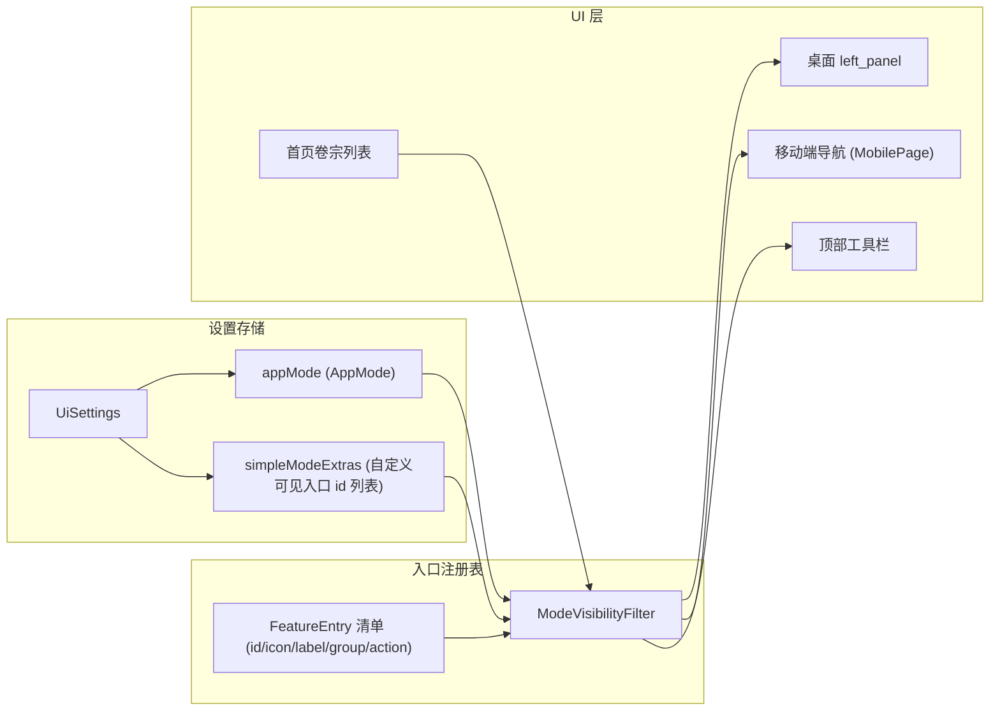

# 简易普通用户模式（Simple User Mode）

Feature Name: simple-user-mode
Updated: 2026-08-12

## Description

为拓墨引入双界面模式：**简易普通用户模式**（默认）与 **标准专业模式**。简易模式保留全部同步（Git/WebDAV/P2P/双向冲突/版本快照/回滚）与完整 AI 对话/模型配置，仅隐藏专业建站、开发、运维与诊断入口，呈现极简侧边栏；同时新增「首页-卷宗文章列表」入口并过滤系统诊断日志。模式切换实时生效、配置互通、不重置任何数据，覆盖桌面端与移动端。

## Architecture



模式状态持久化于 `UiSettings.appMode`，`simpleModeExtras` 保存用户在简易模式下手动加回的入口 id。两处导航（桌面 `left_panel`、移动端 `MobilePage`）统一消费同一份 `FeatureEntry` 注册表经 `ModeVisibilityFilter` 过滤后的可见清单，避免双端逻辑分叉。

## Components and Interfaces

### 1. AppMode 枚举与模式状态

```dart
enum AppMode { simple, standard }
```

- 定义于 `lib/models/ui_settings.dart`，随 `UiSettings` 序列化。
- 模式引导策略：新用户首次启动（无设置文件）默认 `simple`；存量用户首次升级进入（有设置文件但无 `appMode` 记录）弹出模式选择引导弹窗，由用户选择并持久化，不静默回退。

### 2. 入口注册表（FeatureEntry）

```dart
class FeatureEntry {
  final String id;              // 稳定标识，用于白名单与持久化
  final IconData icon;
  final String label;
  final String group;           // 侧边栏分组（创作/站点/管理/工具/AI工具/系统/同步与站点…）
  final VoidCallback action;    // 导航或动作
  final FeatureVisibility defaultInSimple; // shown / hidden / optIn
}

enum FeatureVisibility { shown, hidden, optIn }
```

- 定义于 `lib/desktop/`（如 `feature_entries.dart`），桌面与移动端共用。
- `optIn`：简易模式下默认隐藏，但用户在设置中勾选后可显示（对应需求 R9 与 R3-4 边界模糊入口）。
- 入口定义从 `left_panel.dart` 的硬编码 `_navItem` 列表抽取，替换为注册表驱动渲染。

### 3. ModeVisibilityFilter

```dart
class ModeVisibilityFilter {
  List<FeatureEntry> visibleFor(AppMode mode, List<String> extras);
}
```

- 逻辑：
  - 标准模式：全量可见。
  - 简易模式：`shown` 可见；`optIn` 在 `extras` 包含其 id 时可见；`hidden` 始终不可见。
- 纯函数、可单测。

### 4. 首页-卷宗文章列表（HomeScreen）

- 新增页面（桌面 `desktop_shell` tab 与移动端 `MobilePage.home` 共用）。
- 展示当前卷宗文章列表，按卷宗分组（卷1 / 卷2 …）。
- 过滤规则：文件名以系统前缀开头（`llama_diag_log`）的条目不展示。
- 卷宗字段：`Article.volume`（新增可空字段，随 `toJson`/`fromJson`/`copyWith` 序列化）。

### 5. 模式切换与导航重定向

- 设置页（桌面与移动端）提供模式单选；切换后调用 `LayoutController.notifyListeners` 触发实时重建。
- IF 当前激活页面在简易模式下不可见，导航重定向到首页（HomeScreen）。

### 6. 顶部工具栏精简

- 桌面 `title_bar` / 移动端工具栏按模式过滤按钮：简易模式隐藏「导出诊断日志、批量站点检测、模型连通性批量测试」，保留「搜索、排序、新建文稿」。

## Data Models

### UiSettings 增量

```dart
final AppMode appMode;                 // 默认 AppMode.simple
final List<String> simpleModeExtras;   // 简易模式手动加回入口 id，默认 []
```

`toJson` / `fromJson` 兼容：缺省时按回退策略处理。

### Article 增量

```dart
final String? volume;   // 卷宗（卷1/卷2 …），可空
```

随现有 `toJson` / `fromJson` / `copyWith` 序列化；旧文章反序列化后为 null，归入「未分类」。

## Correctness Properties

1. **配置互通**：模式切换只改变 UI 渲染过滤，`simpleModeExtras` 与 `appMode` 之外的所有配置（模型密钥、同步仓库、Token 档案、存储目录）不受模式影响。
2. **隐藏不删功能**：简易模式隐藏的入口仅不渲染，对应服务、数据与标准模式全部保留。
3. **默认简易与引导**：新用户首次启动默认 `simple`；存量用户首次升级进入弹窗自选模式并持久化。
4. **双端一致**：桌面 left_panel 与移动端导航消费同一注册表与过滤器，可见集合一致。
5. **数据不重置**：切换模式不得触发任何配置清空或数据迁移副作用。
6. **持久化稳定**：`FeatureEntry.id` 一经定义不再变更，保证 `simpleModeExtras` 持久化稳定。

## Error Handling

- **无效入口 id**：`simpleModeExtras` 中含未知 id 时忽略，不影响渲染。
- **反序列化容错**：`appMode` 字段缺失或非法值按回退策略处理，不抛异常。
- **导航目标不可见**：切换模式后当前页不可见时，静默重定向到首页，无报错弹窗。
- **卷宗为空**：无卷宗字段的文章归入「未分类」，首页正常渲染。

## Test Strategy

**单元测试**（`flutter test`）：
- `ModeVisibilityFilter`：标准全显 / 简易按 shown-optIn-hidden 过滤 / extras 白名单生效 / 未知 id 忽略。
- `UiSettings` 序列化：`appMode` 与 `simpleModeExtras` 往返一致；缺失字段回退。
- `Article` 序列化：`volume` 往返一致；旧数据回退 null。
- 系统日志过滤：`llama_diag_log` 前缀命中、普通文章不误伤。

**手工验证**：
- 首次启动进入简易模式；设置切换标准/简易实时生效（双端）。
- 简易模式下同步（Git/WebDAV/P2P/快照/回滚）与 AI（对话/模型配置/密钥/切换）全可用。
- 切换模式后密钥、仓库配置不丢失。
- 简易模式下当前页不可见时自动回首页。
- 首页列表不显示 `llama_diag_log` 文件；标准模式正常显示。

## References

[^1]: (File) - [lib/desktop/widgets/left_panel.dart](lib/desktop/widgets/left_panel.dart) — 桌面侧边栏入口，改为注册表驱动
[^2]: (File) - [lib/controllers/layout_controller.dart](lib/controllers/layout_controller.dart) — MobilePage 导航，新增 home
[^3]: (File) - [lib/models/ui_settings.dart](lib/models/ui_settings.dart) — appMode 与 simpleModeExtras 持久化
[^4]: (File) - [lib/models/article.dart](lib/models/article.dart) — volume 卷宗字段
[^5]: (File) - [lib/desktop/desktop_shell.dart](lib/desktop/desktop_shell.dart) — 桌面 tab 导航与模式切换接线
